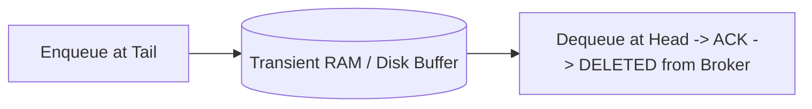

# Message Queues Architecture

## 1. Transient FIFO Queues vs. Distributed Logs
Traditional message queues (e.g., RabbitMQ, AWS SQS, ActiveMQ) operate as transient FIFO buffers:

---

## 2. Key Operational Characteristics
* **Message Deletion on Acknowledgment**: Once consumed and acknowledged, the message ceases to exist in the broker.
* **Granular Per-Message Acknowledgment**: Consumers acknowledge individual messages (`basic.ack` / `basic.nack`).
* **Message Priority**: Many queue implementations support priority levels (`x-max-priority`), allowing urgent transactions to jump to the head of the line.
