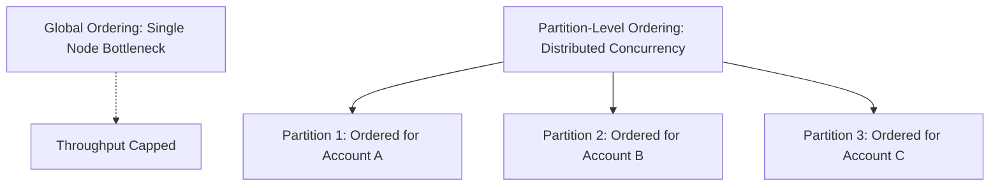

# Message Ordering Guarantees

## 1. The Impossibility of Total Global Ordering
In a distributed system spanning multiple nodes and partitions, enforcing strict total global ordering across all messages requires a single centralized sequencer, reducing throughput to a single-core bottleneck ($<5,000\text{ msgs/sec}$).

---

## 2. Partition-Level Ordering (The Enterprise Pattern)
Systems require ordering **per entity** (e.g., all banking transactions for `account_1234` must execute sequentially; they do not need to be ordered relative to `account_9999`).
* **Message Key Partitioning**:
  $$\text{Partition Index} = \text{MurmurHash2}(\text{Entity Key}) \pmod{\text{Total Partitions}}$$
* Messages with the identical key are guaranteed to land on the same physical partition, ensuring strict FIFO processing within that entity stream.
