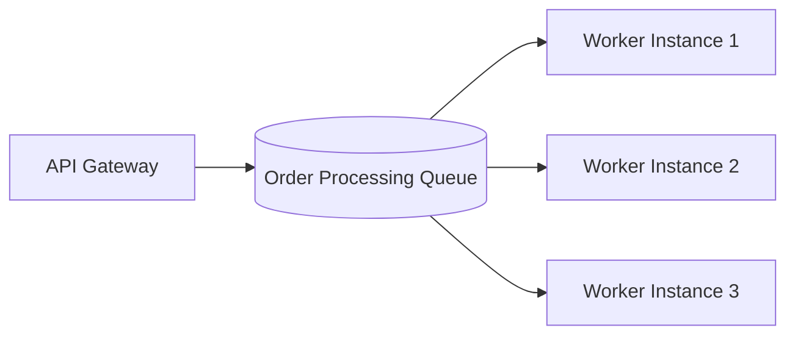

# Point-to-Point Messaging (Queues)

## 1. One-to-One Work Distribution
In Point-to-Point messaging, messages are published to a queue. While multiple worker instances may listen to the queue (**Competing Consumers Pattern**), **each discrete message is processed by exactly one consumer**.

---

## 2. Competing Consumers & Load Balancing
* If Worker 1 claims Message A, Message A is locked and hidden from Worker 2 and 3.
* When Worker 1 acknowledges success (`ACK`), the message is permanently removed from the broker.
* Ideal for distributed task execution, asynchronous background jobs, and heavy worker fleets.
