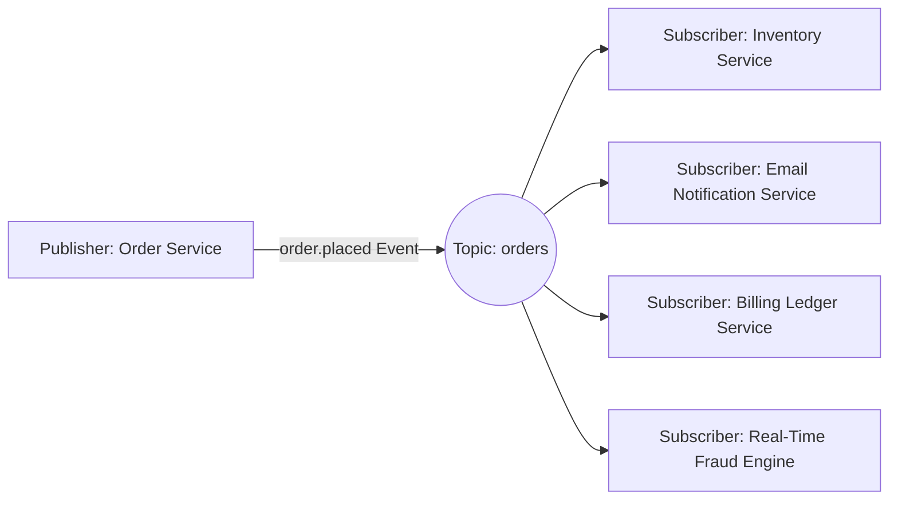

# Publish-Subscribe Pattern (Pub/Sub)

## 1. One-to-Many Message Distribution
In the Publish-Subscribe pattern, publishers emit events to a topic without knowledge of what downstream services exist. Multiple autonomous subscribers register interest and receive their own independent copy of every published event.

---

## 2. Architectural Advantages
* **Zero Coupling**: Adding a new downstream subscriber (e.g., Audit Logger) requires zero changes to the publisher.
* **Independent Scalability**: High-throughput subscribers consume at wire speed; slow reporting subscribers consume asynchronously without degrading order intake.
