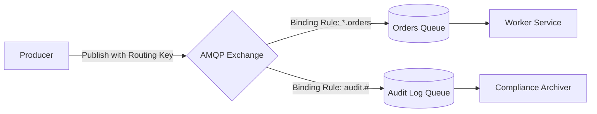

# RabbitMQ Architecture

## 1. The AMQP 0-9-1 Messaging Model
Unlike Kafka's dumb broker model, RabbitMQ is an intelligent routing broker built on Erlang and the Advanced Message Queuing Protocol (AMQP).

---

## 2. Core Exchange Topologies
* **Direct Exchange**: Routes messages based on an exact match between routing key and binding key.
* **Fanout Exchange**: Broadcasts all incoming messages to every bound queue (pure pub/sub).
* **Topic Exchange**: Routes based on wildcard pattern matching (`*` matches one word; `#` matches zero or more words).
* **Headers Exchange**: Routes based on message header attributes rather than routing keys.

---

## 3. Quorum Queues (Raft-Based HA)
Modern RabbitMQ deployments utilize **Quorum Queues** (replicated via the Raft consensus algorithm) instead of legacy mirrored queues, delivering predictable data safety under network partitions.
