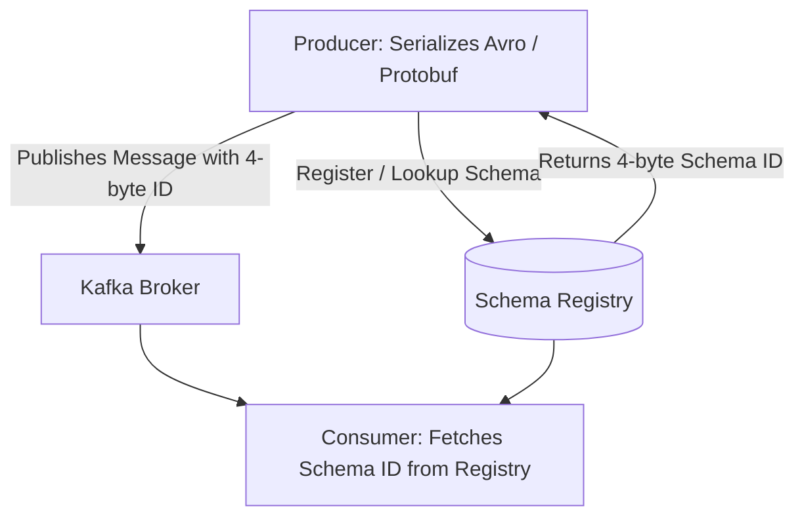

# Schema Registry & Contract Evolution

## 1. The Need for Centralized Schema Governance
In event-driven systems, producers and consumers evolve independently. If a producer removes a JSON field or renames a key without coordination, hundreds of downstream microservices crash on deserialization errors.

---

## 2. Schema Evolution Compatibility Modes

| Mode | Rule | Safe Changes Allowed |
| :--- | :--- | :--- |
| **BACKWARD** | New schema reads data produced by old schema. | Delete fields; add optional fields with defaults. |
| **FORWARD** | Old schema reads data produced by new schema. | Add fields; delete optional fields. |
| **FULL** | Both backward and forward compatible. | Modify only optional fields with defaults. |
| **NONE** | No validation enforced (Hazardous!). | Any breaking change allowed. |
