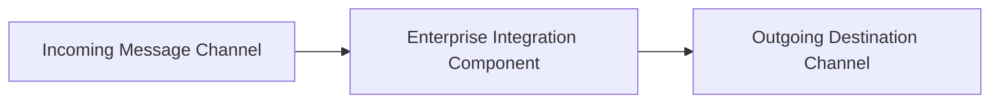

# Integration Pattern: Recipient List Pattern

## 1. Pattern Purpose & Context
Dynamically evaluating message attributes to route a copy of the payload to a computed list of recipient channels.

---

## 2. Structural Pattern Topology

---

## 3. Production Invariants & Evaluation
- Prefer simple standard messaging constructs before introducing complex multi-step routing graphs.
- Protect enricher components with local caching to prevent saturating external reference databases.
- Ensure all split messages retain an immutable correlation ID to enable deterministic downstream aggregation.
