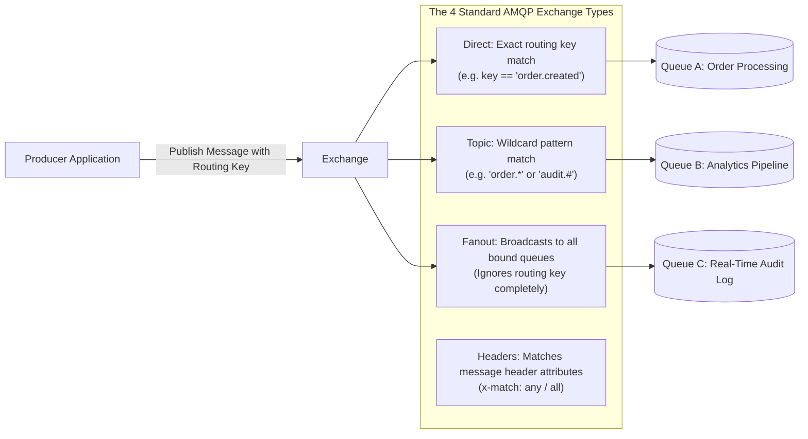
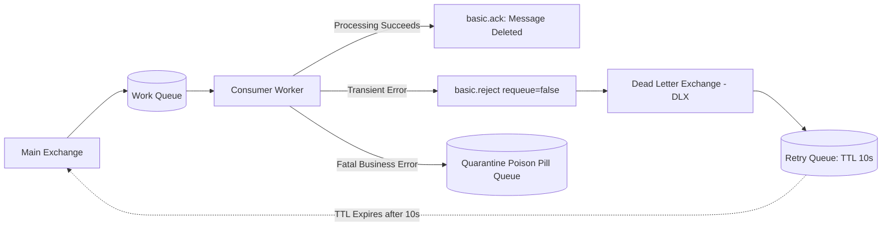

# RabbitMQ Production Architecture: AMQP 0-9-1, Quorum Queues, and DLX Topologies

## 1. Architectural Overview & Context
**RabbitMQ** is an enterprise-grade, open-source message broker implementing the **AMQP 0-9-1** (Advanced Message Queuing Protocol) standard.

While event-streaming brokers like Apache Kafka are distributed append-only commit logs designed for high-volume ordered replays, RabbitMQ is a **smart-broker, dumb-consumer** queuing system designed for complex routing, selective filtering, fine-grained per-message acknowledgements, and work-queue distribution.

```
┌─────────────────────────────────────────────────────────────────────────────┐
│                       KAFKA vs. RABBITMQ ARCHITECTURE                       │
├─────────────────────┬───────────────────────────────────────────────────────┤
│ Apache Kafka        │ Dumb Broker, Smart Consumer. Ordered append-only log; │
│ (Streaming Log)     │ consumer tracks offset; messages retained for days.   │
├─────────────────────┼───────────────────────────────────────────────────────┤
│ RabbitMQ            │ Smart Broker, Dumb Consumer. Complex exchange routing;│
│ (Message Queue)     │ messages deleted immediately upon consumer ACK; DLX.  │
└─────────────────────┴───────────────────────────────────────────────────────┘
```

---

## 2. AMQP 0-9-1 Exchange Topologies

Producers never publish directly to queues in RabbitMQ; they publish to an **Exchange**, which inspects message attributes and routes them to bound queues:



---

## 3. High Availability: Quorum Queues vs. Classic Mirrored Queues

In legacy RabbitMQ clusters, High Availability was achieved using **Classic Mirrored Queues**. Classic mirrored queues suffered from severe architectural flaws: network partitions caused split-brain scenarios, and synchronizing a new node blocked the entire queue.

**Quorum Queues** are the modern, production-grade standard for RabbitMQ HA:
* **Raft Consensus Protocol**: Uses Raft to replicate an append-only log across a majority ($N/2 + 1$) of cluster nodes.
* **Non-Blocking Synchronization**: Adding a new replica node does not freeze publishers or consumers.
* **Data Safety**: All messages are written and fsynced to disk before acknowledgement, guaranteeing zero data loss across leader failovers.

```mermaid
flowchart TD
    subgraph Cluster["RabbitMQ 3-Node Cluster (Quorum Queue: 3 Replicas)"]
        Node1["Node 1: Leader (Handles All Reads & Writes)"]
        Node2["Node 2: Follower Replica"]
        Node3["Node 3: Follower Replica"]
    end

    Publisher[Producer] -->|Publish Message| Node1
    Node1 -->|Replicate Raft Log| Node2
    Node1 -->|Replicate Raft Log| Node3
    Node2 -->>|Raft AppendAck| Node1
    Note over Node1: Quorum Reached (2 of 3 nodes committed)!
    Node1 -->>Publisher: basic.ack (Publisher Confirm)
    Node1 -->|Deliver| Consumer[Consumer]
```

---

## 4. Dead Letter Exchange (DLX) & Exponential Retry Topology

When message processing fails in a consumer, RabbitMQ does not support automatic backoff delays out-of-the-box. Enterprise architects implement a **DLX Retry Loop Topology** using message TTL:



### Configuration:
1. **Work Queue**: Configured with `x-dead-letter-exchange: "retry_dlx"`.
2. **Retry Queue**: Configured with `x-message-ttl: 10000` ($10\text{s}$) and `x-dead-letter-exchange: "main_exchange"`.
3. When consumer rejects a message with `requeue=false`, RabbitMQ automatically routes it to the retry queue. After 10 seconds, the message TTL expires, and RabbitMQ dead-letters it *back* to the main work queue for reprocessing!

---

## 5. Performance Tuning: Consumer Prefetch (`basic.qos`)

By default, RabbitMQ sends all pending queue messages to connected consumers as fast as possible (**unbounded prefetch**).
* **The Disaster**: A consumer node receives 5,000 heavy image-processing jobs at once, runs out of memory, crashes, and RabbitMQ dumps all 5,000 jobs onto the next consumer, triggering a cascading cluster crash!
* **The Architectural Rule**: Always configure a conservative **Consumer Prefetch** (`basic.qos(prefetch_count = 20)`). RabbitMQ will deliver at most 20 unacknowledged messages to a consumer thread.

---

## 6. RabbitMQ Architectural Checklist
- [ ] Mandate **Quorum Queues** (`x-queue-type: quorum`) for all business-critical queues; deprecate classic mirrored queues.
- [ ] Enforce **Publisher Confirms** on producers to guarantee message durability before returning success.
- [ ] Configure `basic.qos` prefetch limits (typically 10–50) on all consumers to prevent worker memory exhaustion.
- [ ] Implement a Dead Letter Exchange (DLX) retry loop with message TTL to avoid blocking work queues.
- [ ] Establish explicit queue length limits (`x-max-length` or `x-max-length-bytes`) with `reject-publish` overflow behavior.
- [ ] Monitor Queue Depth, Consumer Utilization ($< 100\%$), and Unacknowledged Message counts in Prometheus.

---

## 7. Related Modules
* [07-integration/messaging/](../messaging/README.md) — RabbitMQ vs Kafka decision matrix and message queueing patterns.
* [02-system-design/fault-tolerance/](../../02-system-design/fault-tolerance/README.md) — Bulkhead isolation and circuit breaking.
* [01-architecture/integration-architecture/](../../01-architecture/integration-architecture/README.md) — Asynchronous integration paradigms and boundaries.
