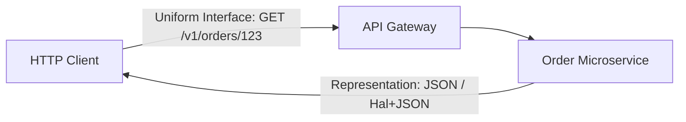

# REST API Architecture & Standards

## 1. Overview & Architectural Philosophy
Representational State Transfer (REST), formulated by Roy Fielding in his 2000 doctoral dissertation, is the ubiquitous architectural style for distributed hypermedia systems. In enterprise API architecture, REST provides stateless, uniform, cacheable, and decoupled interfaces that govern internal microservice boundaries and external partner integrations.

---

## 2. Directory Structure
* [REST Architectural Principles](rest-principles.md)
* [Resource Modeling & URI Design](resource-modeling.md)
* [HTTP Methods & Semantics](http-methods.md)
* [HTTP Status Codes Taxonomy](status-codes.md)
* [API Versioning Strategies](versioning.md)
* [Pagination Patterns](pagination.md)
* [Filtering, Sorting & Field Selection](filtering-and-sorting.md)
* [HATEOAS & Hypermedia](hateoas.md)
* [API Idempotency](idempotency.md)
* [Error Handling (RFC 7807)](error-handling.md)
* [Rate Limiting Headers](rate-limiting.md)
* [HTTP Caching & ETags](caching.md)
* [Content Negotiation](content-negotiation.md)
* [OpenAPI / Swagger Specification](openapi-specification.md)
* [REST vs. gRPC vs. GraphQL](rest-vs-grpc-vs-graphql.md)
