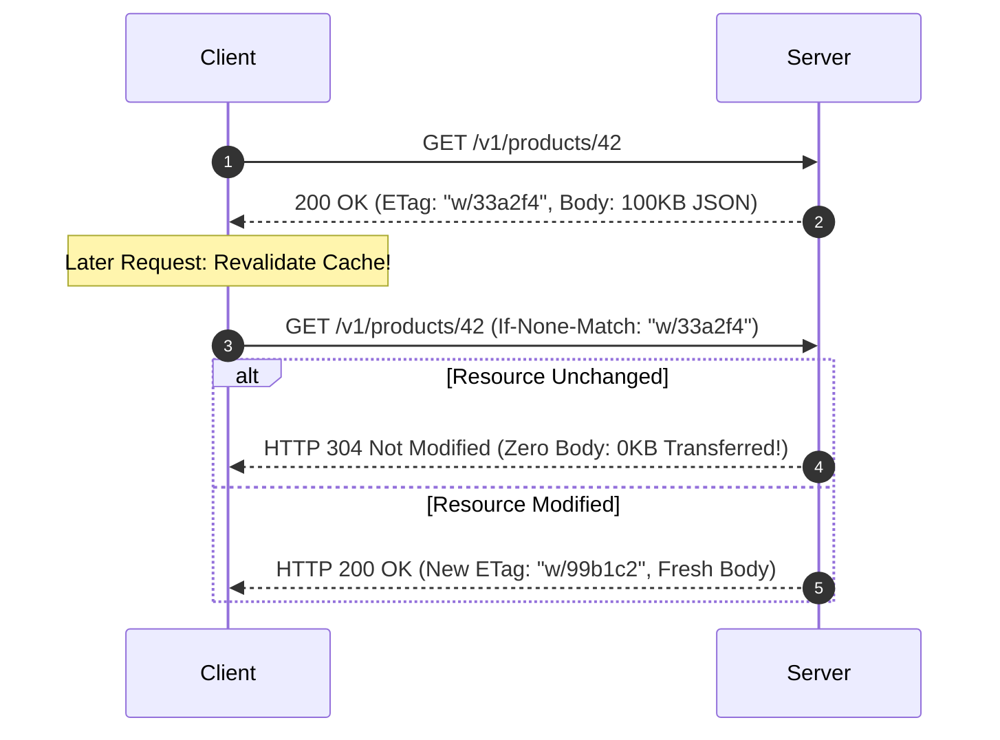

# HTTP Caching & Conditional Requests

## 1. Directives: `Cache-Control`
* `Cache-Control: public, max-age=3600, s-maxage=86400`: Browsers cache for 1 hour; CDN caches for 24 hours.
* `Cache-Control: no-cache`: Client must revalidate with origin using `ETag` before serving cached content.
* `Cache-Control: no-store`: Sensitive PII / payment data; never write to disk or cache.

---

## 2. Conditional Requests via ETags (HTTP 304 Not Modified)

