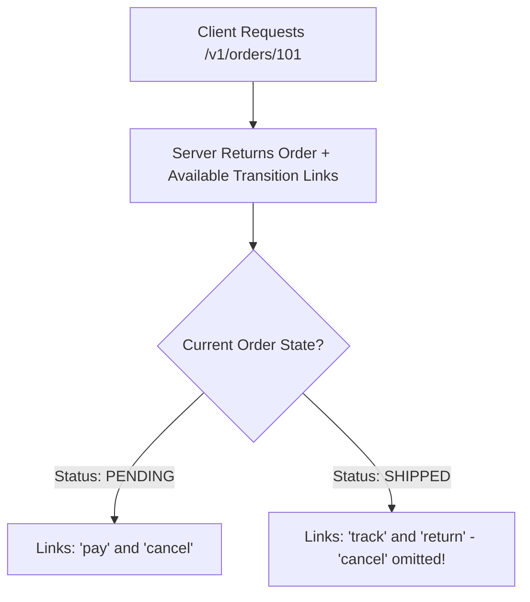

# HATEOAS & Hypermedia Controls

## 1. Concept: Level 3 REST
HATEOAS (Hypermedia As The Engine Of Application State) dictates that clients interact with a network application entirely through hypermedia links provided dynamically by the server within response bodies.



---

## 2. HAL (Hypertext Application Language) Example
```json
{
  "order_id": 101,
  "total": 149.50,
  "status": "PENDING",
  "_links": {
    "self": { "href": "/v1/orders/101" },
    "customer": { "href": "/v1/customers/42" },
    "payment": { "href": "/v1/orders/101/payments", "method": "POST" },
    "cancel": { "href": "/v1/orders/101/cancellation", "method": "PUT" }
  }
}
```
* The client does not hardcode state transition workflows; it inspects `_links` to determine permissible user actions dynamically.
