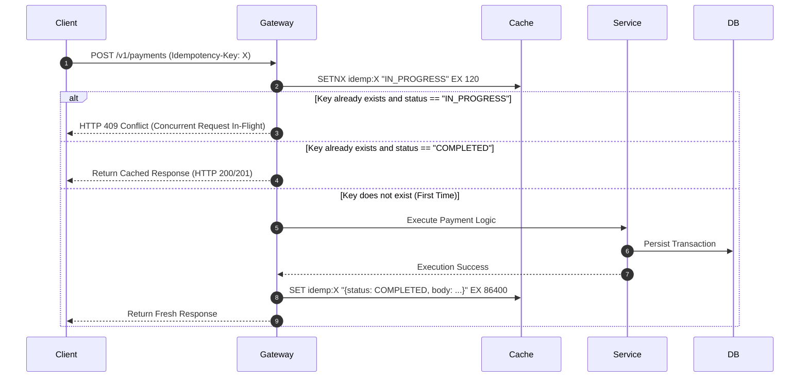

# API Idempotency & IETF Standards

## 1. The IETF Idempotency-Key Specification
Under the IETF Draft standard, mutating HTTP methods (`POST`, `PATCH`) achieve idempotency through client-supplied unique tokens in the request header:
```http
POST /v1/payments HTTP/1.1
Host: api.enterprise.com
Idempotency-Key: 9b1deb4d-3b7d-4bad-9bdd-2b0d7b3dcb6d
```

---

## 2. Server-Side Idempotency Processing Lifecycle


