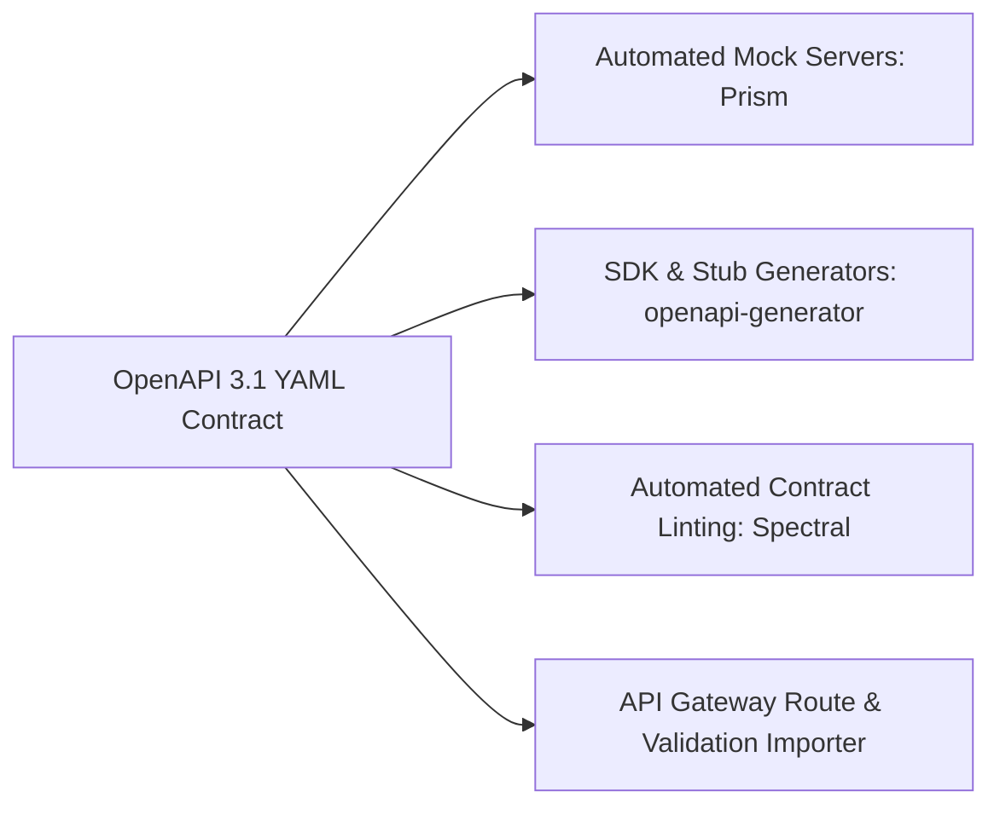

# OpenAPI Specification (OAS 3.1)

## 1. The Machine-Readable Contract
The OpenAPI Specification (OAS) defines a standard, language-agnostic interface description for HTTP APIs.

---

## 2. Contract-First vs. Code-First Engineering
* **Code-First (Anti-Pattern at Scale)**: Writing code and auto-generating swagger annotations results in leaky implementation details, brittle interfaces, and tight coupling.
* **Contract-First (Enterprise Best Practice)**: Designing the OpenAPI YAML specification *before* writing code. Enables parallel frontend/backend development using mock servers.
