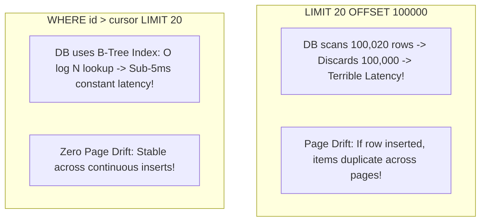

# API Pagination Patterns

## 1. Offset-Based vs. Cursor-Based Pagination



---

## 2. Cursor Pagination Implementation
* Request: `GET /v1/transactions?limit=20&cursor=tx_98124a`
* SQL Query:
  ```sql
  SELECT * FROM transactions 
  WHERE (created_at, id) < ('2026-09-05 10:00:00', 'tx_98124a')
  ORDER BY created_at DESC, id DESC 
  LIMIT 20;
  ```
* Response Payload:
  ```json
  {
    "data": [ ... ],
    "pagination": {
      "has_more": true,
      "next_cursor": "eyJjcmVhdGVkX2F0IjoxNzI1NTA4ODAwLCJpZCI6InR4Xzg4OTEifQ=="
    }
  }
  ```
