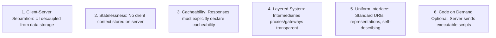

# REST Architectural Principles

## 1. Fielding's Six Architectural Constraints
A system is strictly "RESTful" only if it conforms to Roy Fielding's six core constraints:

---

## 2. Richardson Maturity Model (RMM)
* **Level 0 (The Swamp of POX)**: Single URI, single HTTP method (e.g., SOAP / XML-RPC over `POST /api`).
* **Level 1 (Resources)**: Dedicated URIs for individual resources (`/orders/123`, `/customers/456`).
* **Level 2 (HTTP Verbs)**: Proper usage of standard HTTP methods (`GET`, `POST`, `PUT`, `DELETE`) and status codes (`200`, `201`, `404`).
* **Level 3 (Hypermedia Controls - HATEOAS)**: Self-describing representations containing navigational hypermedia links (`_links`).
