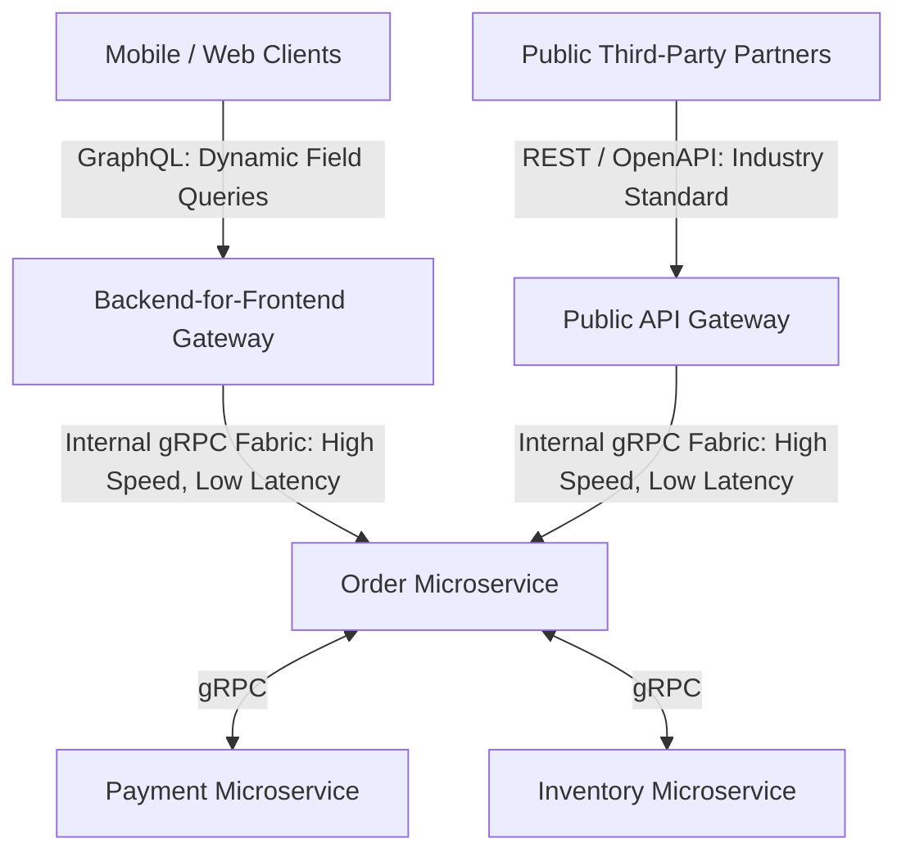

# REST vs. gRPC vs. GraphQL Architectural Comparison

## 1. Triad Comparison Matrix

| Architectural Vector | REST (HTTP/1.1 or HTTP/2) | gRPC (HTTP/2 / HTTP/3) | GraphQL (HTTP POST) |
| :--- | :--- | :--- | :--- |
| **Payload Protocol** | Text JSON / XML | Binary Protocol Buffers | Text JSON |
| **Transport** | HTTP/1.1, HTTP/2 | HTTP/2 (Strict Multiplexing) | HTTP/1.1, HTTP/2 |
| **Interface Definition** | OpenAPI / JSON Schema | Protocol Buffers (`.proto`) | GraphQL Schema SDL |
| **Performance / Latency**| Moderate ($10\text{--}50\text{ ms}$) | Ultra-High ($1\text{--}5\text{ ms}$) | Moderate (Query parsing cost) |
| **Streaming Support** | Server-Sent Events (SSE) | Full Bi-Directional Streaming | Subscriptions (WebSockets) |
| **Client Control** | Server decides schema | Server decides schema | Client queries exact fields |
| **Edge Caching** | Native via HTTP headers | Difficult (RPC model) | Difficult (All requests POST) |

---

## 2. The Enterprise Polyglot Synthesis

