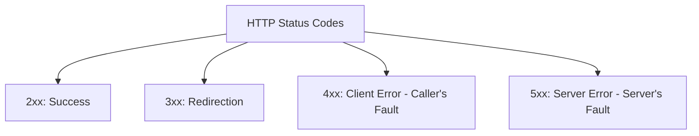

# HTTP Status Codes Taxonomy

## 1. Master Classification

---

## 2. Essential Status Codes for Enterprise APIs
* **200 OK**: Synchronous read or non-creation write success.
* **201 Created**: Resource successfully created; response includes `Location: /v1/orders/123`.
* **202 Accepted**: Asynchronous batch job accepted for background processing.
* **204 No Content**: Action succeeded with empty response body (standard for `DELETE`).
* **400 Bad Request**: Malformed JSON or syntax failure.
* **401 Unauthorized**: Missing or invalid authentication token (JWT).
* **403 Forbidden**: Valid token, but user lacks authorization permission.
* **404 Not Found**: Resource URI does not exist.
* **409 Conflict**: State conflict (e.g., duplicate unique constraint, optimistic lock version mismatch).
* **422 Unprocessable Entity**: Valid JSON, but semantic domain validation failed.
* **429 Too Many Requests**: Rate limit breached; includes `Retry-After` header.
* **500 Internal Server Error**: Unhandled application crash.
* **502 Bad Gateway**: Upstream proxy or microservice unreachable.
* **503 Service Unavailable**: Server overloaded or circuit breaker tripped.
* **504 Gateway Timeout**: Downstream microservice exceeded deadline.
