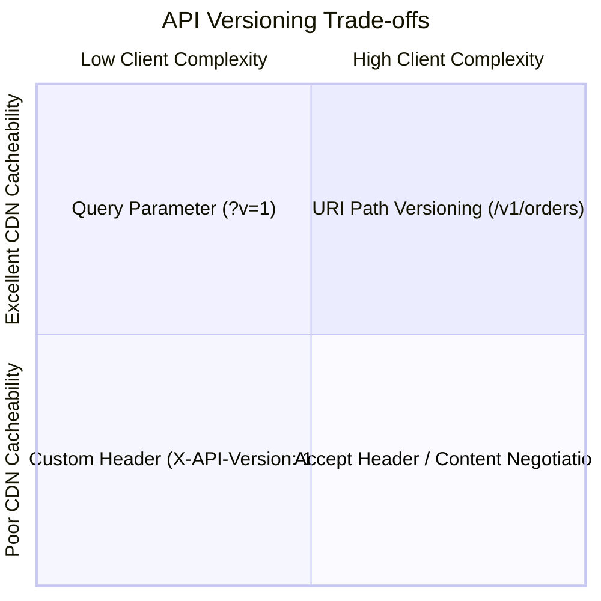

# API Versioning Strategies

## 1. Versioning Paradigms Comparison

| Strategy | Example | Pros | Cons |
| :--- | :--- | :--- | :--- |
| **URI Path** (Recommended) | `/v1/orders`, `/v2/orders` | Explicit, easy to route at API gateway, highly CDN-friendly. | Changes resource URI. |
| **Header** | `X-API-Version: 2` | Preserves clean URIs. | Harder to test via browser; requires custom routing rules. |
| **Accept Header (MIME)** | `Accept: application/vnd.company.v2+json` | Purest REST adherence. | High client complexity; difficult to cache at edge proxies. |
