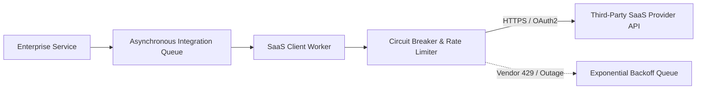

# SaaS Integration: Data Portability, Egress & Lock-In Mitigation

## 1. Architectural Purpose & Problem Context
Automated daily bulk exports, canonical data normalization, and planning vendor migration/replacement strategies without enterprise disruption.

---

## 2. Resilient SaaS Integration Topology

---

## 3. Production Invariants
- Never invoke external SaaS APIs synchronously within the critical customer checkout or transaction path.
- Cache external OAuth access tokens securely in memory until expiration minus a 5-minute safety threshold.
