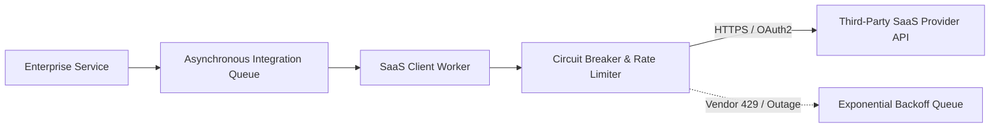

# SaaS Integration: OAuth2, Credential Management & Token Governance

## 1. Architectural Purpose & Problem Context
Managing multi-tenant SaaS client credentials: token caching, automatic refresh token flows, and integrating with enterprise secret managers.

---

## 2. Resilient SaaS Integration Topology

---

## 3. Production Invariants
- Never invoke external SaaS APIs synchronously within the critical customer checkout or transaction path.
- Cache external OAuth access tokens securely in memory until expiration minus a 5-minute safety threshold.
