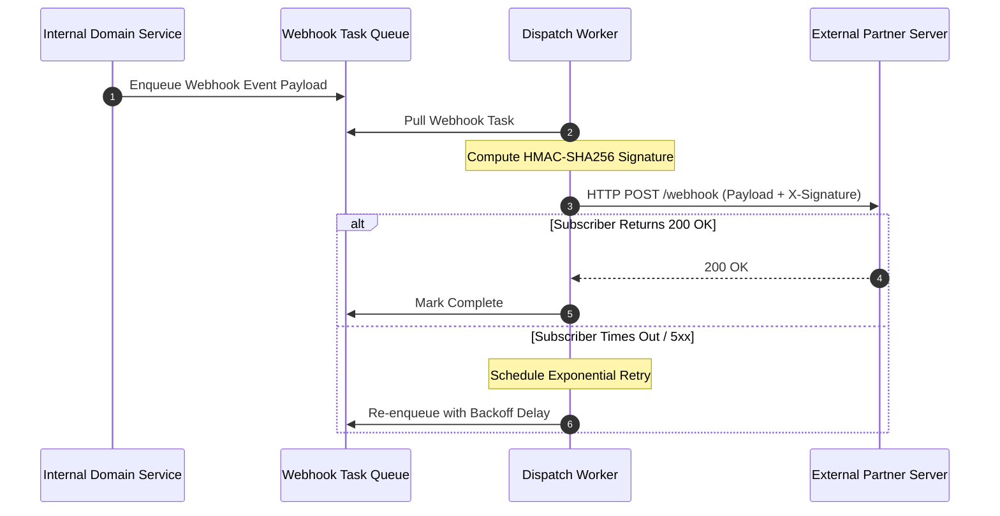

# Webhook Architecture: Webhook Failure Handling, DLQ & Monitoring

## 1. Architectural Purpose & Problem Context
Automated subscriber disablement after consecutive 5xx errors, subscriber self-service failure dashboards, and manual event resend APIs.

---

## 2. Webhook Outbound Pipeline

---

## 3. Production Invariants
- All webhook payloads must be signed using HMAC-SHA256 with tenant-specific shared secrets.
- Webhook endpoints must never perform heavy processing synchronously; consumers must validate, enqueue, and return 200 OK immediately.
