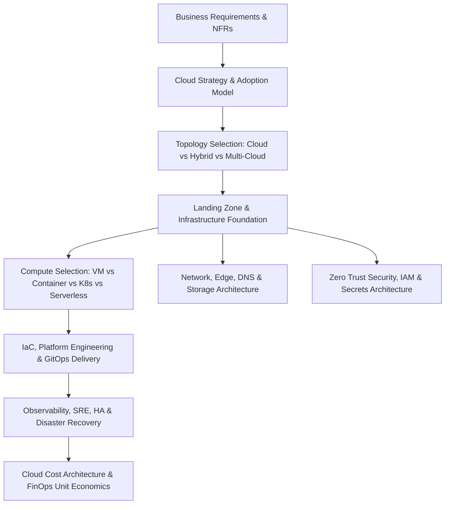

# Phase 6 — Cloud & Infrastructure Architecture

## 1. Executive Summary & Architectural Mission

The **Cloud & Infrastructure Architecture** layer operationalizes application (Phase 4) and data/integration (Phase 5) designs into resilient, secure, cost-optimized, and observable production platforms for Fortune 500 enterprises, regulated financial institutions, and global SaaS organizations.



---

## 2. Core Architecture Philosophy

> **Cloud is an execution environment, not an architecture strategy by itself.**

Enterprise infrastructure decisions must never be based on technology fashion or provider marketing. Every architectural choice must be systematically derived from:
- **Business Criticality & Compliance**: RTO, RPO, regulatory jurisdiction, data residency, sovereignty.
- **Workload Profile**: Stateless HTTP vs heavy event streaming vs stateful ACID OLTP vs distributed batch.
- **Scale & Traffic Dynamics**: Predictable baseline vs extreme spikiness, global geographic distribution.
- **Operational Reality**: Team engineering maturity, cognitive load, maintenance burden, total cost of ownership (TCO).

### The Architecture Decision Sequence

```text
Business Requirements & Constraints
        ↓
Workload Characteristics & Data Profile
        ↓
Non-Functional Requirements (NFRs: Latency, Throughput, RTO/RPO)
        ↓
Infrastructure Options (Cloud vs Hybrid vs Multi-Cloud)
        ↓
Trade-off Analysis (Managed Services vs Portability vs Complexity)
        ↓
Architecture Decision Record (ADR)
        ↓
Landing Zone & Platform Blueprint
        ↓
Implementation via Infrastructure as Code (IaC)
        ↓
Observability & Day-2 Reliability Engineering
        ↓
Continuous FinOps Optimization & Architectural Evolution
```

---

## 3. Directory Navigation

| Module | Description | Core Deliverables |
| :--- | :--- | :--- |
| **[Cloud Principles](cloud-principles.md)** | 20 non-negotiable enterprise cloud principles | Principles, Guardrails, Blast Radius control |
| **[Fundamentals](fundamentals/README.md)** | Core shifts, service models, failure domains | IaaS/PaaS/SaaS/FaaS, Shared Responsibility, Control vs Data Plane |
| **[Cloud Strategy](cloud-strategy/README.md)** | Adoption, exit strategies, operating models | Cloud-first vs Smart, Repatriation, CCoE, Platform Teams |
| **[Hybrid Cloud](hybrid-cloud/README.md)** | Enterprise DC & Cloud integration | Direct Connect, ExpressRoute, Hybrid DB/Messaging, Legacy Integration |
| **[Multi-Cloud](multi-cloud/README.md)** | Reality of multi-cloud architectures | Active-Active vs Active-Passive, Portability truth, Decision Matrix |
| **[AWS Architecture](aws/README.md)** | Architectural capabilities on AWS | Landing Zones, VPC, ECS/EKS, Aurora, Serverless, IAM |
| **[Azure Architecture](azure/README.md)** | Enterprise blueprints on Azure | Subscriptions, Management Groups, AKS, Cosmos DB, Entra ID |
| **[GCP Architecture](gcp/README.md)** | Google Cloud platform blueprints | Resource Hierarchy, GKE, Cloud Run, Spanner, BigQuery, VPC |
| **[Cloud Provider Comparison](cloud-provider-comparison/README.md)** | Objective AWS vs Azure vs GCP comparison | Compute, Storage, Database, Networking, Messaging, FinOps |
| **[Compute Architecture](compute/README.md)** | Compute runtime selection framework | Bare Metal vs VMs vs Containers vs K8s vs Serverless |
| **[Container Architecture](containers/README.md)** | Production container design | Docker runtime, OCI images, Supply chain security, Registries |
| **[Kubernetes Architecture](kubernetes/README.md)** | Deep enterprise Kubernetes architecture | Control plane, GitOps, Ingress, HPA, **When NOT to use K8s** |
| **[Serverless Architecture](serverless/README.md)** | FaaS and event-driven serverless platforms | Cold starts, Concurrency limits, State management, Step Functions |
| **[Networking Architecture](networking/README.md)** | Enterprise cloud networking | VPC/VNet, Transit Gateways, PrivateLink, Zero Trust segmentations |
| **[Load Balancing](load-balancing/README.md)** | L4/L7 and global traffic management | Anycast, Global vs Regional LB, Session affinity, Blue/Green routing |
| **[DNS Architecture](dns/README.md)** | Resilient DNS routing | Geo-routing, Latency routing, Split-horizon DNS, Multi-cloud DNS |
| **[CDN & Edge Architecture](cdn-edge/README.md)** | Edge compute and caching | CloudFront/Cloudflare, Cache invalidation, Origin shielding, WAF |
| **[Storage Architecture](storage/README.md)** | Enterprise storage selection | Block (EBS/Disk), File (EFS/Azure Files), Object (S3/GCS), Lifecycle |
| **[Infrastructure Security](infrastructure-security/README.md)** | Defense-in-depth and Zero Trust | Security groups, Network ACLs, CSPM, Workload identities |
| **[IAM Architecture](iam/README.md)** | Identity as the primary perimeter | RBAC, ABAC, SSO Federation, Cross-account access, Least privilege |
| **[Secrets Management](secrets-management/README.md)** | Secrets, certificates, and KMS | KMS envelope encryption, Dynamic secrets, Vault, Secret rotation |
| **[Infrastructure as Code](infrastructure-as-code/README.md)** | Declarative immutable infrastructure | State management, Drift detection, Modularization, Policy as Code |
| **[Terraform Architecture](terraform/README.md)** | Enterprise Terraform blueprints | Module design, Remote state locking, Workspaces, CI/CD pipelines |
| **[Configuration Management](configuration-management/README.md)** | App vs Infra configuration | Parameter stores, Dynamic configuration, Git-backed configuration |
| **[Platform Engineering](platform-engineering/README.md)** | Internal Developer Platforms (IDP) | Golden paths, Backstage, Self-service infrastructure, Guardrails |
| **[Landing Zones](landing-zones/README.md)** | Multi-account enterprise foundations | Small, Mid-size, Large, and Regulated Enterprise Landing Zones |
| **[Cloud Governance](governance/README.md)** | Cloud governance framework | Tagging baselines, Resource quotas, Policy enforcement (OPA/Kyverno) |
| **[High Availability](high-availability/README.md)** | Multi-AZ and Multi-Region HA | Stateless vs Stateful HA, Quorum systems, Split-brain mitigation |
| **[Disaster Recovery](disaster-recovery/README.md)** | RTO/RPO strategies & drill plans | Backup/Restore, Pilot Light, Warm Standby, Multi-Region Active-Active |
| **[Business Continuity](business-continuity/README.md)** | Enterprise business continuity | BCP vs DR, Business impact analysis (BIA), Failover runbooks |
| **[Capacity Planning](capacity-planning/README.md)** | Empirical infrastructure sizing | Instance sizing formulas, Network bandwidth, IOPS estimation |
| **[Cloud Cost Architecture](cloud-cost/README.md)** | Architectural cost modeling | Architectural cost drivers, Egress engineering, Reserved capacity |
| **[FinOps](finops/README.md)** | FinOps lifecycle and unit economics | Cost allocation, Cost per transaction, Cost per tenant, Showback |
| **[Observability](observability/README.md)** | Cloud infrastructure observability | Metrics, Logs, Tracing, OpenTelemetry, SLOs, Synthetic monitoring |
| **[Cloud Reliability](reliability/README.md)** | SRE and resilience patterns | Bulkheads, Circuit breakers, Load shedding, Chaos engineering |
| **[Deployment Architecture](deployment/README.md)** | Zero-downtime release strategies | Rolling, Blue/Green, Canary, Progressive Delivery, Schema migrations |
| **[Cloud Migration](migration/README.md)** | The 7Rs migration playbook | Rehost, Replatform, Refactor, Wave planning, Cutover, Decommissioning |
| **[Architecture Patterns](architecture-patterns/README.md)** | 10 battle-tested cloud patterns | 3-tier, Modular Monolith, Event-Driven, Multi-Region, Hub-and-Spoke |
| **[Decision Frameworks](decision-frameworks/README.md)** | Measurable decision scorecards | Provider, Compute, Storage, Migration, and DR frameworks |
| **[Anti-Patterns](anti-patterns/README.md)** | 24 documented cloud anti-patterns | Kubernetes everywhere, Blind multi-cloud, Public databases, IaC drift |

---

## 4. Cross-Phase Architectural Integration

Phase 6 directly connects to all surrounding layers of the enterprise handbook:
- **Phase 2 (Architecture Fundamentals)**: Grounding infrastructure in measurable NFRs, SLA/SLO definitions, and ADR governance documented in [`16-architecture-deliverables/adr/`](../16-architecture-deliverables/adr/).
- **Phase 3 (System Design & Distributed Systems)**: Translating distributed consensus, CAP theorem, replication topologies, and caching tiers into physical cloud AZs, VPCs, and storage services.
- **Phase 4 (Application Engineering Architecture)**: Containerizing and deploying .NET, Java, Python, and Node.js microservices and modular monoliths to EKS, ECS, App Services, or Cloud Run.
- **Phase 5 (Data & Integration Architecture)**: Hosting transactional databases (PostgreSQL, Aurora, Cosmos DB), Kafka clusters, and CDC pipelines across private cloud subnets with automated backup and cross-region replication.
- **Phase 7 (Security & Operations - Upcoming)**: Providing the underlying network boundaries, IAM roles, and secret stores for DevSecOps pipelines and SIEM systems.
- **Cloud Migration & Modernization**: Detailed runbooks, 7Rs frameworks, and reverse-replication rollback patterns codified in [`migration/README.md`](migration/README.md).
