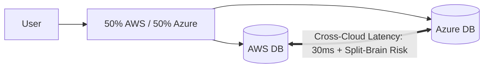

# Cloud Anti-Pattern: Blind Multi-Cloud Without Business Justification

## 1. The Anti-Pattern Defined
Splitting production traffic across multiple cloud providers simultaneously in the name of 'avoiding vendor lock-in'.

---

## 2. Visual Representation

---

## 3. Why This Fails in Enterprise Production
- WAN network latency destroys ACID transaction throughput.
- Doubling cloud compliance, tooling, and training costs.
- The enterprise becomes locked into complex custom orchestration tooling, which is worse than provider lock-in.

---

## 4. Architectural Remediation & Best Practice
Standardize on **one primary hyper-scaler** for core transactional workloads. Adopt a secondary provider only for asynchronous, best-of-breed services (e.g., BigQuery analytics).
