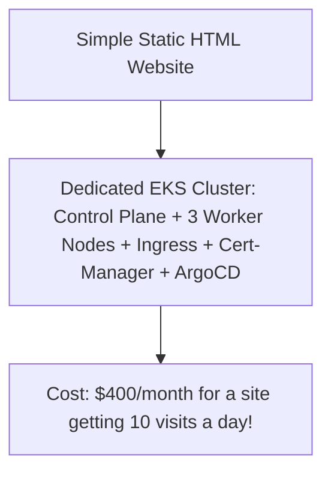

# Cloud Anti-Pattern: Kubernetes Everywhere (Premature K8s Mandate)

## 1. The Anti-Pattern Defined
Mandating that every application, internal tool, and static website must run in a dedicated Kubernetes cluster, regardless of scale or workload characteristics.

---

## 2. Visual Representation

---

## 3. Why This Fails in Enterprise Production
- SRE burnout from continuous cluster version upgrades every 14 months.
- Software engineers spending 30% of their time writing Helm templates and debugging CNI networking rather than shipping business features.

---

## 4. Architectural Remediation & Best Practice
Adopt **Serverless Containers (Google Cloud Run / AWS ECS + Fargate / Azure Container Apps)** for 80% of standard applications. Authorize Kubernetes only when complex operators or high-density binpacking explicitly justifies the operational tax.
