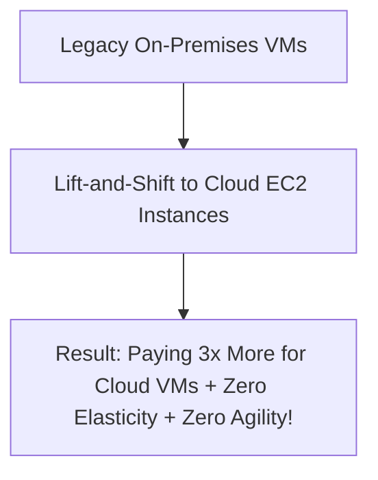

# Cloud Anti-Pattern: Lift-and-Shift Forever (Unmodernized Rehosting)

## 1. The Anti-Pattern Defined
Migrating legacy monolithic VMs directly to cloud IaaS instances and never executing Day-2 modernization.

---

## 2. Visual Representation

---

## 3. Why This Fails in Enterprise Production
- Cloud VMs running 24/7 at 10% CPU utilization cost significantly more than depreciated on-premises hardware.
- Preserves technical debt while increasing operational expenditure.

---

## 4. Architectural Remediation & Best Practice
Treat Rehosting as a temporary phase. Establish a mandatory **Modernization Phase** (Replatform to managed databases and containers) within 6 months post-migration.
