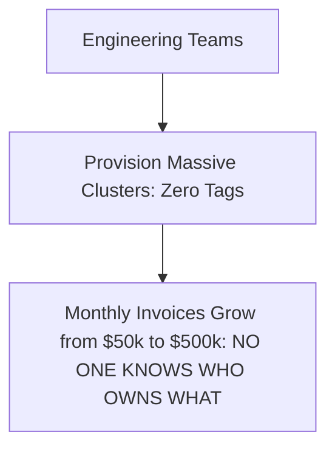

# Cloud Anti-Pattern: Unallocated Cloud Spend (No Cost Ownership)

## 1. The Anti-Pattern Defined
Allowing engineering teams to provision cloud infrastructure without mandatory cost allocation tags or financial accountability.

---

## 2. Visual Representation

---

## 3. Why This Fails in Enterprise Production
- Cloud spend compounds uncontrollably; orphaned resources run indefinitely without business justification.

---

## 4. Architectural Remediation & Best Practice
Enforce **Mandatory Resource Tagging** via Service Control Policies (blocking resource creation without `CostCenter` and `Owner`). Implement monthly showback reports.
