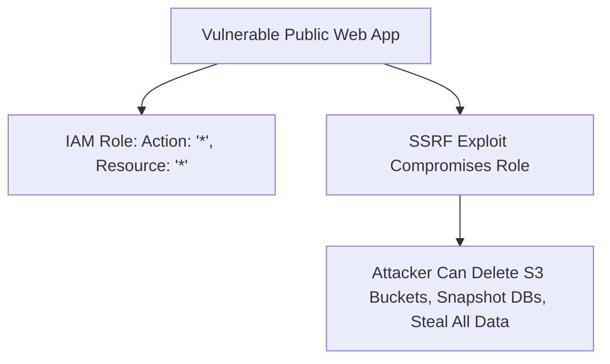

# Cloud Anti-Pattern: Over-Permissioned IAM Policies (Wildcard Access)

## 1. The Anti-Pattern Defined
Granting `AdministratorAccess` or wildcard `*` permissions to application compute roles to avoid debugging IAM errors during development.

---

## 2. Visual Representation

---

## 3. Why This Fails in Enterprise Production
- A single application vulnerability (e.g., SSRF) leads to total cloud account compromise and data exfiltration.

---

## 4. Architectural Remediation & Best Practice
Enforce the **Principle of Least Privilege**. Use IAM Access Analyzer to prune unused permissions and enforce automated CI/CD linting blocking wildcard policies.
