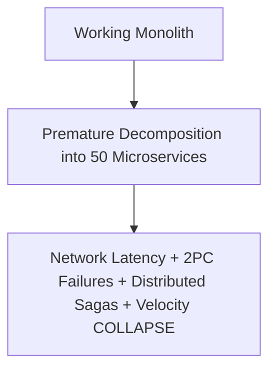

# Cloud Anti-Pattern: Premature Cloud-Native Microservices Refactoring

## 1. The Anti-Pattern Defined
Decomposing a stable, well-understood monolith into 50 microservices before achieving operational maturity or domain clarity.

---

## 2. Visual Representation

---

## 3. Why This Fails in Enterprise Production
- Distributed systems complexity paralyzes small engineering teams.
- Network latency across services degrades transaction performance.

---

## 4. Architectural Remediation & Best Practice
Build a **Modular Monolith** first. Extract microservices incrementally only when scaling bottlenecks or team organization mandates it.
