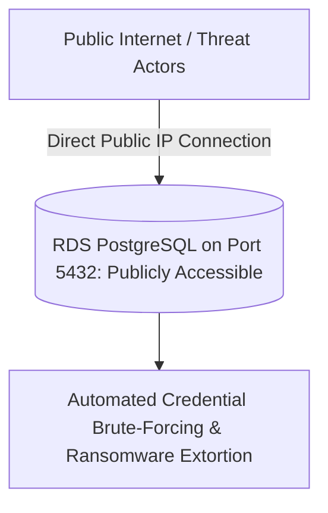

# Cloud Anti-Pattern: Publicly Exposed Cloud Databases

## 1. The Anti-Pattern Defined
Assigning public IP addresses to managed databases (RDS, Cloud SQL, Cosmos DB) to allow developers to connect directly from their laptops.

---

## 2. Visual Representation

---

## 3. Why This Fails in Enterprise Production
- The leading cause of cloud database breaches.
- Exposes database listening ports to continuous automated internet port scanning and zero-day exploitation.

---

## 4. Architectural Remediation & Best Practice
Isolate all databases strictly inside **Isolated Private Subnets** with zero public IP addresses. Developers must connect via **Identity-Aware Bastions (AWS SSM Session Manager / Azure Bastion)**.
