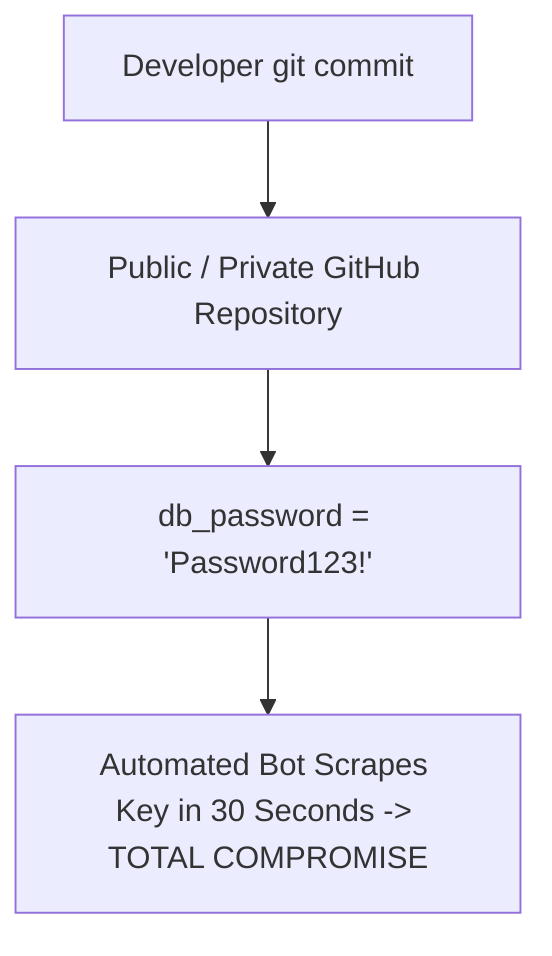

# Cloud Anti-Pattern: Hardcoding Secrets in Source Code

## 1. The Anti-Pattern Defined
Embedding database connection strings, API tokens, and private keys directly inside application source code repositories.

---

## 2. Visual Representation

---

## 3. Why This Fails in Enterprise Production
- Automated malicious scrapers compromise credentials within minutes of a repository push.

---

## 4. Architectural Remediation & Best Practice
Enforce **Pre-Commit Hooks (Trufflehog / Gitleaks)**. Store all credentials in managed cloud vaults injected as ephemeral in-memory mounts.
