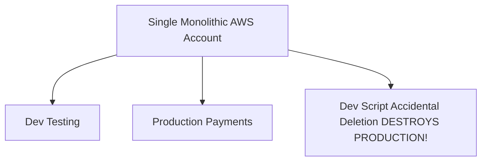

# Cloud Anti-Pattern: Shared Multi-Tenant Production Accounts

## 1. The Anti-Pattern Defined
Hosting multiple disparate application domains, development tiers, and testing environments inside a single monolithic cloud account.

---

## 2. Visual Representation

---

## 3. Why This Fails in Enterprise Production
- Massive blast radius: an error in a development pipeline can delete production databases.
- Security audit failure for regulated workloads.

---

## 4. Architectural Remediation & Best Practice
Enforce a **Multi-Account Landing Zone**. Dedicate isolated cloud accounts per application per environment (Prod vs Non-Prod).
