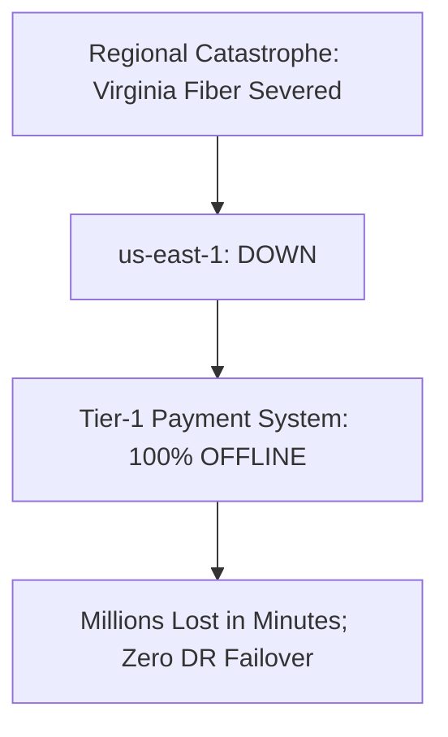

# Cloud Anti-Pattern: Single-Region Critical Workloads

## 1. The Anti-Pattern Defined
Hosting Tier-1 mission-critical revenue-generating systems in a single cloud region with zero cross-region disaster recovery capability.

---

## 2. Visual Representation

---

## 3. Why This Fails in Enterprise Production
- Cloud regions do experience catastrophic outages (cooling loss, fiber cuts, control plane bugs).
- Unrecoverable financial and reputational damage.

---

## 4. Architectural Remediation & Best Practice
Enforce **Multi-Region Warm Standby or Pilot Light** for all Tier-1/Tier-2 systems with automated DNS failover and continuous asynchronous database replication.
