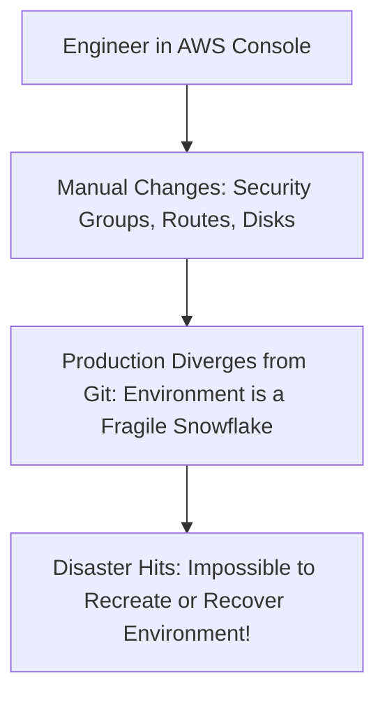

# Cloud Anti-Pattern: Snowflake Manual Infrastructure (ClickOps)

## 1. The Anti-Pattern Defined
Creating, modifying, and tuning cloud infrastructure manually through the web management console rather than version-controlled IaC.

---

## 2. Visual Representation

---

## 3. Why This Fails in Enterprise Production
- Environments cannot be reproduced during a disaster recovery event.
- Configuration drift makes debugging production issues impossible.

---

## 4. Architectural Remediation & Best Practice
Enforce **100% Declarative Infrastructure as Code (Terraform/OpenTofu)**. Revoke interactive write permissions in production consoles; all changes must route through CI/CD pipelines.
