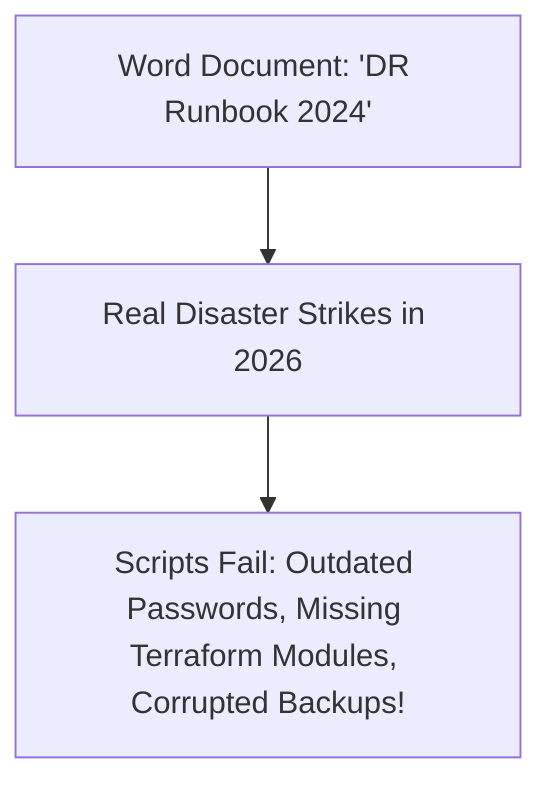

# Cloud Anti-Pattern: Untested Disaster Recovery Plans

## 1. The Anti-Pattern Defined
Maintaining disaster recovery documentation as Word/PDF runbooks that are never validated in live conditions.

---

## 2. Visual Representation

---

## 3. Why This Fails in Enterprise Production
- In an actual regional disaster, unverified failover scripts fail, backup snapshots are missing, and the system suffers catastrophic permanent downtime.

---

## 4. Architectural Remediation & Best Practice
Execute **Automated Game Day Drills** quarterly. Verify automated restoration of database snapshots and failover routing in isolated sandbox accounts.
