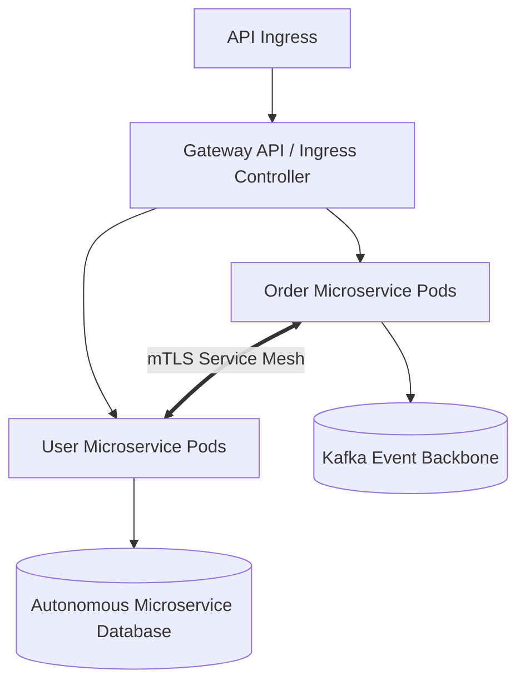

# Cloud Pattern: Cloud-Native Microservices on Kubernetes

## 1. Executive Summary
Domain-driven microservices architecture hosted on managed Kubernetes (EKS/AKS/GKE) with service mesh, GitOps delivery, and distributed observability.

---

## 2. Architecture Blueprint

---

## 3. Problem Statement
Large-scale enterprises with hundreds of developers require autonomous deployment cadences and granular scaling across independent business domains.

---

## 4. Business Context & Drivers
High-growth digital platforms, multi-product SaaS environments, banking platforms with decentralized engineering teams.

---

## 5. When to Use
- Large engineering organizations (> 50 developers) organized into stream-aligned teams.
- High release frequency (multiple daily deployments).
- Heterogeneous programming language runtimes.

---

## 6. When NOT to Use
- Small engineering teams (< 15 developers).
- Simple monolithic workloads.
- Organizations lacking dedicated 24/7 Kubernetes SRE rotations.

---

## 7. Architectural Benefits
- Total team deployment autonomy.
- Independent horizontal scaling per domain.
- Polyglot runtime flexibility.

---

## 8. Technical Trade-Offs
- Extreme operational complexity.
- Distributed systems failure modes (cascading timeouts, network partitions).
- Complex distributed data consistency (Sagas required).

---

## 9. Failure Modes & Resilience
- **Pod Crash**: Kubernetes Kubelet restarts pod immediately.
- **Worker Node Failure**: Pods rescheduled across healthy AZ nodes.
- **Cascading Failure**: Circuit breakers shed load to protect downstream dependencies.

---

## 10. Security Architecture
- Strict mTLS encryption between all pods via Envoy service mesh.
- Default-deny Kubernetes NetworkPolicies in all namespaces.
- Workload identity federation.

---

## 11. Scalability Characteristics
Pod-level horizontal autoscaling (HPA) in seconds; cluster-level node expansion via Karpenter in sub-45 seconds.

---

## 12. Financial Cost Dynamics
High baseline cluster fee; requires active Karpenter binpacking and Spot instance integration to avoid massive resource waste.

---

## 13. Operational Considerations & Evolution
### Operational Day-2 Reality
Operated strictly via GitOps (ArgoCD); requires OpenTelemetry distributed tracing to diagnose latency waterfalls.

### Future Architectural Evolution
Evolve by selectively migrating bursty, event-driven components to serverless containers (Cloud Run / Knative).
