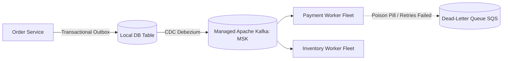

# Cloud Pattern: Event-Driven Cloud Architecture with Kafka & DLQ

## 1. Executive Summary
Asynchronous event-driven architecture using managed streaming brokers, transactional outbox patterns, and dead-letter queues.

---

## 2. Architecture Blueprint

---

## 3. Problem Statement
Synchronous REST APIs create tight runtime coupling; if downstream inventory is slow, the upstream checkout API hangs and fails.

---

## 4. Business Context & Drivers
Financial clearing, e-commerce order fulfillment, IoT telemetry processing, real-time audit logging.

---

## 5. When to Use
- High-throughput systems requiring temporal decoupling.
- Systems broadcasting state changes to multiple independent consumers.
- Asynchronous background processing pipelines.

---

## 6. When NOT to Use
- Simple synchronous request-response CRUD applications.
- Workloads requiring instantaneous hard real-time consistency.

---

## 7. Architectural Benefits
- Extreme temporal decoupling; producers operate regardless of consumer health.
- High throughput and message durability.
- Event replay capabilities for disaster recovery.

---

## 8. Technical Trade-Offs
- Eventual consistency requires asynchronous UI design.
- Difficult distributed debugging; complex schema evolution governance.

---

## 9. Failure Modes & Resilience
- **Consumer Crash**: Kafka consumer group automatically rebalances partitions to healthy workers.
- **Poison Pill**: Diverted to DLQ after 3 failed retries without stalling the topic.

---

## 10. Security Architecture
- TLS in transit with SASL/SCRAM or IAM authentication; schema validation via Schema Registry.

---

## 11. Scalability Characteristics
Horizontal partitioning allows scaling to millions of events per second across partitioned worker fleets.

---

## 12. Financial Cost Dynamics
Cost dominated by broker instance sizing and storage retention policies; use tiered storage to S3 to control spend.

---

## 13. Operational Considerations & Evolution
### Operational Day-2 Reality
Requires continuous monitoring of Consumer Group Lag and DLQ depth.

### Future Architectural Evolution
Evolve by introducing stream processing engines (Apache Flink) for real-time windowed event aggregations.
