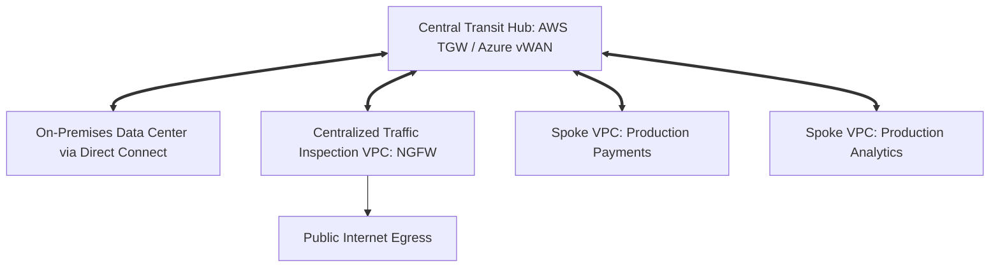

# Cloud Pattern: Hub-and-Spoke Enterprise Network Transit

## 1. Executive Summary
Centralized transit network topology connecting hundreds of spoke VPCs, on-premises data centers, and centralized firewall inspection hubs.

---

## 2. Architecture Blueprint

---

## 3. Problem Statement
Managing point-to-point VPC peering across dozens of enterprise accounts creates unmaintainable routing meshes and prevents centralized security inspection.

---

## 4. Business Context & Drivers
Enterprise cloud landing zones, regulated financial institutions, large corporate cloud estates.

---

## 5. When to Use
- Multi-account enterprise environments with > 5 VPCs.
- Regulated workloads requiring deep packet inspection for all egress traffic.
- Hybrid cloud connectivity to corporate data centers.

---

## 6. When NOT to Use
- Small startups with 1–2 simple VPCs.
- Low-latency HPC clusters requiring direct un-routed instance interconnects.

---

## 7. Architectural Benefits
- Transitive routing simplifies network architecture.
- Single choke point for enterprise security inspection and egress filtering.
- Scalable to thousands of spoke attachments.

---

## 8. Technical Trade-Offs
- Transit Gateway hourly attachment fees and data processing charges ($0.02/GB).
- Adds minor latency hop (< 1ms).

---

## 9. Failure Modes & Resilience
- **Transit Hub Degradation**: Cloud provider manages multi-AZ redundant gateway fabric.
- **Firewall Node Crash**: Autoscaling firewall fleet heals automatically.

---

## 10. Security Architecture
- Dedicated routing tables isolate environments (e.g., Dev spokes cannot route to Prod spokes).

---

## 11. Scalability Characteristics
Supports up to 50 Gbps per VPC attachment; scales horizontally with equal-cost multi-path (ECMP) routing.

---

## 12. Financial Cost Dynamics
Data processing fees must be monitored; bypass inspection for trusted high-volume S3 data via Gateway Endpoints.

---

## 13. Operational Considerations & Evolution
### Operational Day-2 Reality
Managed centrally by the Network Platform Team; route changes automated via Terraform.

### Future Architectural Evolution
Evolve by introducing Software-Defined Wide Area Network (SD-WAN) integrations at the edge.
