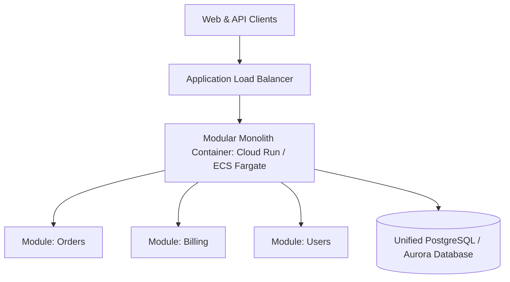

# Cloud Pattern: Modular Monolith on Managed Cloud Containers

## 1. Executive Summary
A single deployable unit structured internally into strictly isolated bounded contexts, running on managed serverless containers.

---

## 2. Architecture Blueprint

---

## 3. Problem Statement
Avoiding the distributed systems complexity, network latency, and operational overhead of microservices while maintaining clean domain boundaries.

---

## 4. Business Context & Drivers
Early-to-mid stage enterprise products, core business applications with high domain complexity but modest engineering team sizes (< 30 devs).

---

## 5. When to Use
- Greenfield enterprise systems.
- Teams prioritizing developer velocity and rapid iteration.
- Systems where ACID transactions across business domains are essential.

---

## 6. When NOT to Use
- Teams with > 200 developers working in the same codebase.
- Systems requiring independent hardware specialization (e.g., GPU compute for ML alongside web API).

---

## 7. Architectural Benefits
- Single deployment pipeline; zero distributed network latency.
- Simple local development and end-to-end integration testing.
- Full relational ACID transactions across modules.

---

## 8. Technical Trade-Offs
- Shared compute and database scaling ceiling.
- A fatal memory leak in one module crashes the entire monolith.

---

## 9. Failure Modes & Resilience
- **Process Crash**: Managed container platform replaces instance in < 5 seconds.
- **Database Failover**: Managed Aurora/Cloud SQL initiates automated failover.

---

## 10. Security Architecture
- Standard VPC private subnet isolation; unified IAM role per container task.

---

## 11. Scalability Characteristics
Scales horizontally by adding container instances behind the load balancer.

---

## 12. Financial Cost Dynamics
Extremely cost-efficient; eliminates multi-cluster K8s overhead and cross-service network egress bills.

---

## 13. Operational Considerations & Evolution
### Operational Day-2 Reality
Standard CI/CD pipeline building a single Docker image; unified APM monitoring.

### Future Architectural Evolution
Extract specific high-traffic modules into autonomous microservices using the Strangler Fig pattern only when scaling mandates it.
