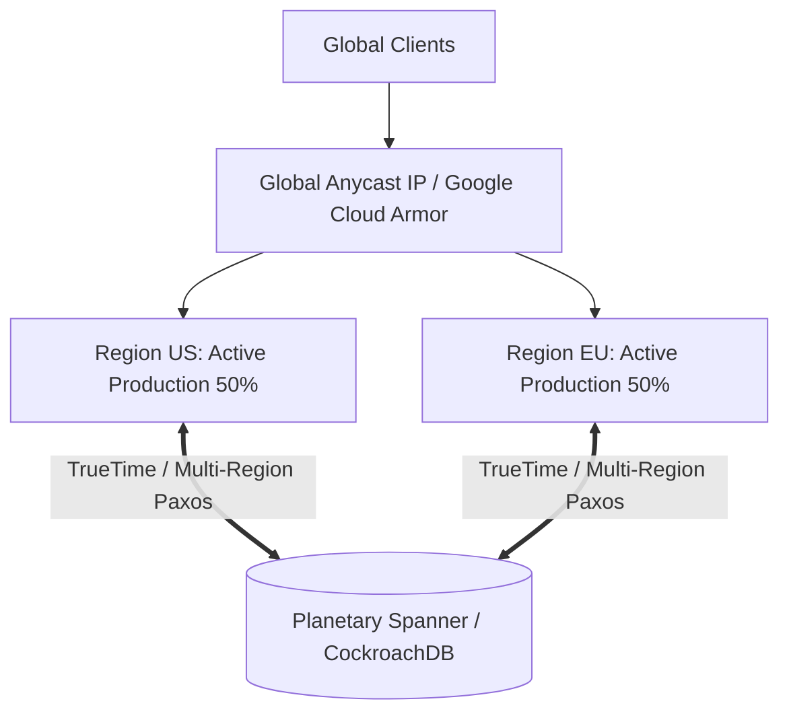

# Cloud Pattern: Multi-Region Active-Active with Global Anycast

## 1. Executive Summary
Planetary-scale active-active deployment serving traffic simultaneously from multiple continental regions with distributed ACID consensus.

---

## 2. Architecture Blueprint

---

## 3. Problem Statement
Serving global users with local low latency while surviving the catastrophic destruction of an entire continental cloud region with near-zero RTO/RPO.

---

## 4. Business Context & Drivers
Global banking ledgers, international airline reservation systems, global authentication engines.

---

## 5. When to Use
- Systems with legally mandated sub-minute RTO and zero RPO cross-region.
- Worldwide customer base demanding sub-50ms latency globally.

---

## 6. When NOT to Use
- 95% of standard enterprise applications.
- Systems with budget constraints.
- Relational databases that cannot support distributed Paxos consensus.

---

## 7. Architectural Benefits
- Near-zero RTO; instantaneous failover via Anycast IP routing.
- Lowest global user latency.

---

## 8. Technical Trade-Offs
- Extreme financial cost ($2.5x base).
- Complex data conflict resolution; high cross-region data transfer fees.

---

## 9. Failure Modes & Resilience
- **Complete Regional Outage**: Edge Anycast routes packets away from dead region in sub-seconds; zero database downtime.

---

## 10. Security Architecture
- Multi-region KMS keys; data sovereignty zoning to comply with GDPR/CCPA.

---

## 11. Scalability Characteristics
Planetary horizontal scalability across continental compute and database splits.

---

## 12. Financial Cost Dynamics
Extremely high; multi-region data replication and Spanner node costs represent significant investment.

---

## 13. Operational Considerations & Evolution
### Operational Day-2 Reality
Requires multi-region SRE rotations and automated chaos engineering drills.

### Future Architectural Evolution
Continually optimize by regionalizing data partitions to minimize cross-oceanic Paxos commit waits.
