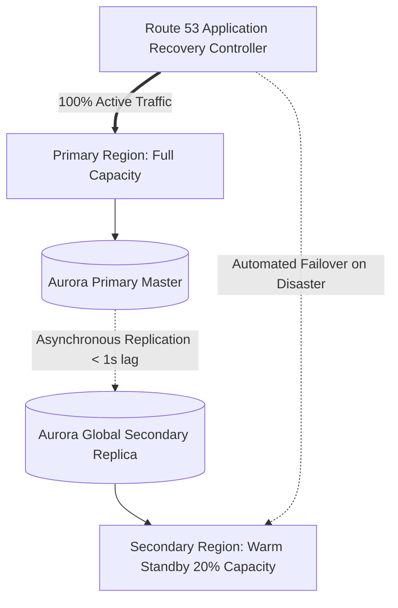

# Cloud Pattern: Multi-Region Active-Passive with Warm Standby

## 1. Executive Summary
Cost-effective disaster recovery architecture running production in a primary region with an asynchronous warm standby replica in a secondary region.

---

## 2. Architecture Blueprint

---

## 3. Problem Statement
Achieving sub-15 minute RTO and near-zero RPO without the catastrophic expense and complexity of multi-master active-active.

---

## 4. Business Context & Drivers
Core enterprise business applications, SaaS platforms, banking APIs.

---

## 5. When to Use
- Mission-critical systems requiring regional disaster recovery.
- Workloads where a 5–15 minute failover window is acceptable to business.

---

## 6. When NOT to Use
- Systems where zero-millisecond failover is legally mandated (requires active-active).
- Non-critical systems where backup & restore suffices.

---

## 7. Architectural Benefits
- 40% cheaper than active-active.
- Simple single-master transactional consistency.
- Rapid, deterministic failover.

---

## 8. Technical Trade-Offs
- Standby capacity runs 24/7, incurring baseline idle cost.
- Seconds of asynchronous data loss during sudden unannounced primary failure.

---

## 9. Failure Modes & Resilience
- **Primary Region Outage**: DNS switches to secondary; standby database promoted to master in < 1 minute.

---

## 10. Security Architecture
- Replicated KMS keys across regions; identical IAM role definitions.

---

## 11. Scalability Characteristics
Primary region autoscales normally; secondary region autoscales instantly upon receiving failover traffic.

---

## 12. Financial Cost Dynamics
Infrastructure cost is approximately 1.6x of single-region spend.

---

## 13. Operational Considerations & Evolution
### Operational Day-2 Reality
Requires quarterly automated failover drills to verify operational runbooks.

### Future Architectural Evolution
Automate failover execution using AWS ARC routing controls.
