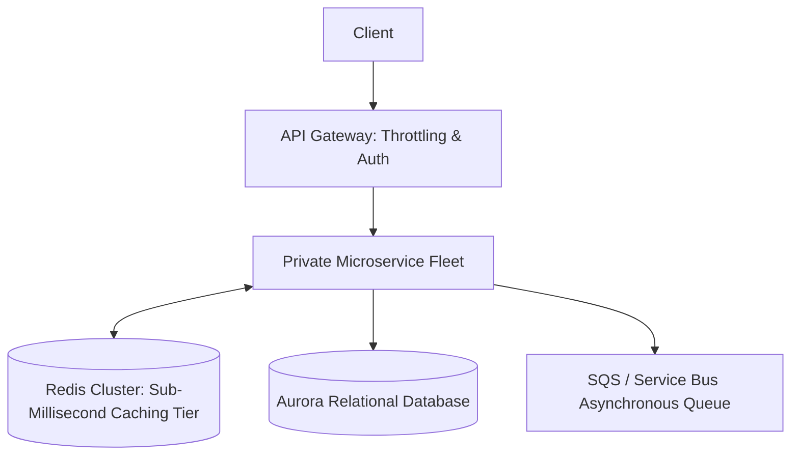

# Cloud Pattern: N-Tier Cloud Architecture with In-Memory Caching

## 1. Executive Summary
Multi-tier enterprise architecture introducing dedicated API gateways, microservices layers, in-memory caching tiers, and asynchronous event buses.

---

## 2. Architecture Blueprint

---

## 3. Problem Statement
Single-tier databases cannot handle hundreds of thousands of concurrent read queries without latency degradation.

---

## 4. Business Context & Drivers
High-traffic consumer applications, digital banking, content platforms.

---

## 5. When to Use
- Workloads with 80/20 read-to-write ratios.
- Systems requiring API gateway throttling and rate limiting.

---

## 6. When NOT to Use
- Simple internal CRUD tools with minimal traffic.

---

## 7. Architectural Benefits
- Offloads 90% of read queries from the relational database.
- Granular rate limiting and authentication at the API edge.

---

## 8. Technical Trade-Offs
- Cache invalidation complexity; risk of serving stale data.

---

## 9. Failure Modes & Resilience
- **Cache Node Failure**: Redis cluster promotes replica in < 15s; database absorbs temporary load.

---

## 10. Security Architecture
- mTLS between API gateway and microservices; private Redis endpoints.

---

## 11. Scalability Characteristics
Redis cluster shards horizontally; microservices autoscale based on request depth.

---

## 12. Financial Cost Dynamics
Moderate; Redis instance costs are offset by rightsizing the primary database.

---

## 13. Operational Considerations & Evolution
### Operational Day-2 Reality
Monitor cache hit ratio and eviction rates continuously.

### Future Architectural Evolution
Evolve to event-driven cache updates using CDC from the primary database.
