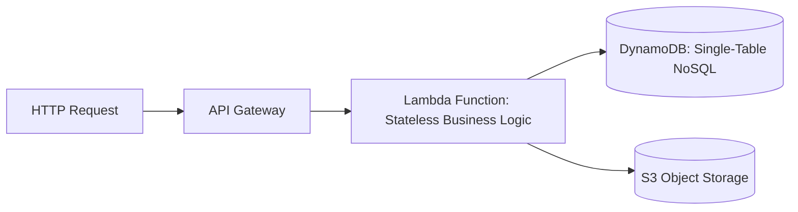

# Cloud Pattern: Serverless Cloud Platform Pattern

## 1. Executive Summary
Pure serverless application stack combining API Gateway, Function-as-a-Service, and managed serverless NoSQL datastores.

---

## 2. Architecture Blueprint

---

## 3. Problem Statement
Eliminating server management, OS patching, and paying for idle capacity during low-traffic periods.

---

## 4. Business Context & Drivers
Event-driven webhooks, mobile application backends, bursty consumer portals.

---

## 5. When to Use
- Unpredictable or highly variable traffic profiles.
- Rapid greenfield MVP development.
- Workloads benefiting from instant scale-to-zero.

---

## 6. When NOT to Use
- Steady-state, high-concurrency continuous workloads (containers are cheaper).
- Long-running batch compute (> 15 minutes).

---

## 7. Architectural Benefits
- Zero server operations.
- 100% free at zero traffic.
- Instant automated scaling.

---

## 8. Technical Trade-Offs
- Cold start latency.
- Proprietary cloud vendor lock-in.

---

## 9. Failure Modes & Resilience
- **Function Crash**: Request retried or returns 500 immediately; next invocation uses a fresh microVM.

---

## 10. Security Architecture
- Granular micro-IAM role per function; API Gateway JWT authorizers.

---

## 11. Scalability Characteristics
Scales automatically to thousands of concurrent executions in seconds.

---

## 12. Financial Cost Dynamics
Extremely cheap at low volumes; expensive at sustained hyper-scale.

---

## 13. Operational Considerations & Evolution
### Operational Day-2 Reality
Requires structured JSON logging and distributed tracing via OpenTelemetry.

### Future Architectural Evolution
Migrate high-frequency endpoints to Cloud Run/Fargate if monthly invocation costs exceed container fleet costs.
