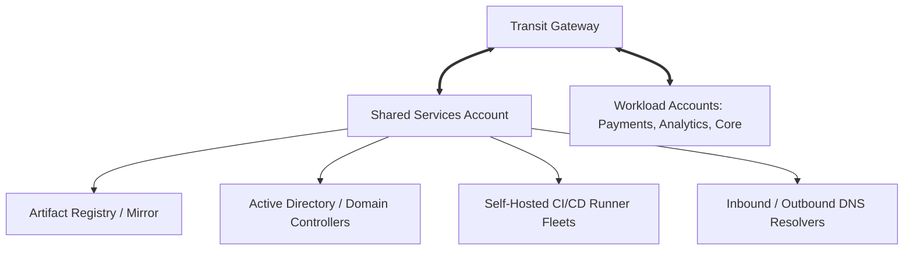

# Cloud Pattern: Shared Services Enterprise Landing Zone Pattern

## 1. Executive Summary
Dedicated cloud account topology hosting common enterprise services consumed by all workload accounts.

---

## 2. Architecture Blueprint

---

## 3. Problem Statement
Duplicating shared tools, domain controllers, and artifact registries across hundreds of individual workload accounts wastes millions and fractures governance.

---

## 4. Business Context & Drivers
Enterprise multi-account cloud landing zones.

---

## 5. When to Use
- Any enterprise operating > 5 cloud accounts.
- Central platform teams delivering shared tooling.

---

## 6. When NOT to Use
- Small single-account organizations.

---

## 7. Architectural Benefits
- Eliminates redundant tool licensing and infrastructure.
- Centralized security inspection and artifact vulnerability scanning.

---

## 8. Technical Trade-Offs
- Shared services account becomes a high-value security target.
- Network transit dependencies across accounts.

---

## 9. Failure Modes & Resilience
- **Shared Service Outage**: Multi-AZ deployment of domain controllers and runners ensures internal resilience.

---

## 10. Security Architecture
- Restrictive IAM trust policies; traffic permitted only from authorized spoke VPC CIDRs.

---

## 11. Scalability Characteristics
Shared services autoscale based on cross-account enterprise demand.

---

## 12. Financial Cost Dynamics
Saves 30–50% on enterprise tooling infrastructure by consolidating instances.

---

## 13. Operational Considerations & Evolution
### Operational Day-2 Reality
Maintained and operated exclusively by the central Cloud Platform Team.

### Future Architectural Evolution
Evolve by migrating self-hosted runners to cloud-native managed serverless runner pools.
