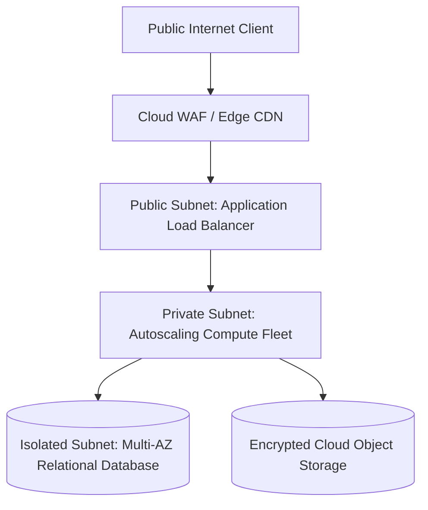

# Cloud Pattern: Three-Tier Cloud Architecture

## 1. Executive Summary
The foundational cloud architecture pattern isolating presentation, business logic, and persistence into dedicated, non-overlapping multi-AZ subnets.

---

## 2. Architecture Blueprint

---

## 3. Problem Statement
Modern web applications require strict network boundary isolation to ensure database and internal business compute cannot be directly addressed from the public internet.

---

## 4. Business Context & Drivers
Enterprise web portals, corporate intranet applications, customer account management systems, and standard e-commerce backends.

---

## 5. When to Use
- Standard web and enterprise line-of-business applications.
- Relational data models with strict ACID transaction requirements.
- Teams transitioning from traditional on-premises architectures to cloud.

---

## 6. When NOT to Use
- Extreme micro-burst event streaming (> 500,000 events/sec).
- Ultra-low latency trading systems (< 1ms).
- Purely static frontend applications with serverless backends.

---

## 7. Architectural Benefits
- Clean separation of concerns across network tiers.
- Minimal attack surface; zero public IPs on compute or database instances.
- Predictable multi-AZ high availability.

---

## 8. Technical Trade-Offs
- Rigid network segmentation requires NAT gateways for outbound compute egress.
- Monolithic database scaling ceiling.

---

## 9. Failure Modes & Resilience
- **AZ Data Center Outage**: Multi-AZ load balancers automatically route traffic to healthy AZs; Aurora promotes read replica in < 30s.
- **App Compute Crash**: Auto Scaling Group replaces failed instances automatically.

---

## 10. Security Architecture
- WAF at edge inspects OWASP Top 10.
- Security groups enforce strict unidirectional ingress.
- Data encrypted with KMS CMK at rest.

---

## 11. Scalability Characteristics
Horizontal autoscaling at web/app tier based on CPU/request count. Relational database scales vertically or via read replicas.

---

## 12. Financial Cost Dynamics
Highly predictable baseline cost. NAT gateway data processing fees represent the primary variable cost driver.

---

## 13. Operational Considerations & Evolution
### Operational Day-2 Reality
Requires centralized logging to CloudWatch/Log Analytics and automated patching via immutable AMIs.

### Future Architectural Evolution
Evolve by deconstructing the application tier into serverless containers (Cloud Run / Fargate) and adding Redis caching.
