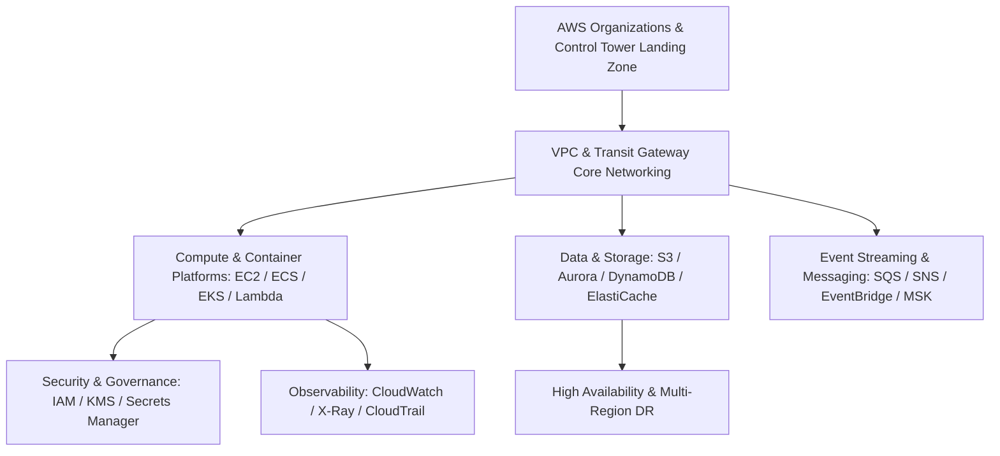

# AWS Architecture: Enterprise Capabilities & Patterns

## Executive Summary

This section provides architectural blueprints and decision frameworks for designing enterprise platforms on Amazon Web Services (AWS). It is structured around **architectural capabilities**, evaluated through trade-offs, scaling limits, failure modes, security implications, and cost models—not an exhaustive service dictionary.

---

## AWS Architectural Capabilities Map

---

## Architecture Blueprints & Guides

| Capability Area | Document | Core Focus & Architectural Evaluation |
| :--- | :--- | :--- |
| **Landing Zone & Hierarchy**| **[Account Architecture](account-architecture.md)** | Organizations, OUs, SCP guardrails, Control Tower |
| **Identity & Access** | **[IAM & Governance](iam-and-governance.md)** | IAM Identity Center, Permission Boundaries, Workload Roles |
| **Networking** | **[Networking & VPC](networking-and-vpc.md)** | VPC, Subnets, Transit Gateway, PrivateLink, Route 53 |
| **Virtual Compute** | **[Compute: EC2 & Nitro](compute-ec2.md)** | Nitro System, Instance Families, Graviton, Spot Fleets |
| **Container Platform** | **[Containers: ECS & Fargate](containers-ecs-fargate.md)** | ECS vs EKS, Fargate serverless containers, Task definitions |
| **Managed Kubernetes** | **[Kubernetes: EKS](kubernetes-eks.md)** | EKS architecture, Karpenter node autoscaling, IRSA |
| **Serverless Compute** | **[Serverless: Lambda](serverless-lambda.md)** | Concurrency limits, Cold starts, SnapStart, Event sources |
| **Storage Tier** | **[Storage: S3, EBS, EFS](storage-s3-ebs-efs.md)** | S3 Intelligent-Tiering, EBS gp3/io2, EFS Elastic mounts |
| **Relational Databases** | **[Databases: RDS & Aurora](databases-rds-aurora.md)** | Aurora distributed storage engine, Global Databases, Multi-AZ |
| **NoSQL Databases** | **[NoSQL: DynamoDB](nosql-dynamodb.md)** | Single-table design, Partition keys, Global Tables, DAX |
| **In-Memory Caching** | **[Caching: ElastiCache](caching-elasticache.md)** | Redis vs Memcached, Cluster mode, Replication topologies |
| **Enterprise Messaging** | **[Messaging: SQS, SNS, EventBridge](messaging-sqs-sns-eventbridge.md)**| FIFO vs Standard, Fanout patterns, Schema Registry |
| **Streaming Platform** | **[Streaming: Managed Kafka (MSK)](streaming-msk.md)** | Provisioned vs Serverless MSK, Storage auto-expansion |
| **API Management** | **[API Gateway](api-gateway.md)** | REST vs HTTP APIs, Private integrations, Authorizers |
| **Secrets & Encryption** | **[Security: KMS & Secrets Manager](security-kms-secrets.md)**| Envelope encryption, KMS key policies, Automatic rotation |
| **Observability** | **[Observability: CloudWatch & X-Ray](observability-cloudwatch.md)** | Structured metrics, Embedded Metric Format (EMF), Traces |
| **Disaster Recovery** | **[Disaster Recovery Patterns](disaster-recovery.md)** | Cross-region backup, Aurora Global failover, Route 53 health |
