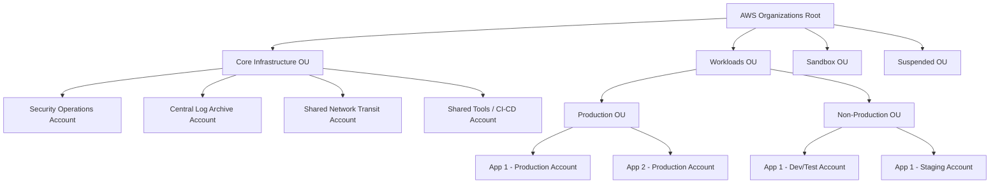

# AWS Account Architecture & Landing Zones

## Executive Summary

At enterprise scale, deploying workloads into a single AWS account is an unacceptable security and operational anti-pattern. Enterprise AWS architecture requires a **Multi-Account Landing Zone** governed by **AWS Organizations** and **Service Control Policies (SCPs)** to isolate blast radius, enforce compliance, and allocate costs.

---

## 1. Enterprise Multi-Account Hierarchy

---

## 2. Core Account Functions & Guardrails

| Account Type | Primary Responsibility | Critical Guardrails (SCPs) |
| :--- | :--- | :--- |
| **Security Operations** | GuardDuty master, Security Hub aggregator, IAM Identity Center directory. | Prohibit disabling AWS Config; prohibit deleting S3 compliance logs. |
| **Log Archive** | Central immutable S3 bucket receiving CloudTrail and VPC Flow Logs. | Strict Object Lock (WORM compliance); deny `s3:Delete*` even to root. |
| **Network Transit** | Central AWS Transit Gateway, AWS Network Firewall, Direct Connect gateways. | Restrict internet gateway (IGW) attachments outside approved DMZ subnets. |
| **Workload Production** | Runs dedicated production microservices and databases. | Deny unencrypted EBS volumes; deny public IP assignment to EC2/RDS. |
| **Workload Non-Prod** | Development, integration testing, and performance benchmarking. | Restrict costly instance types (e.g., deny `p4d`, `u-12tb1`); enforce auto-shutdown. |
