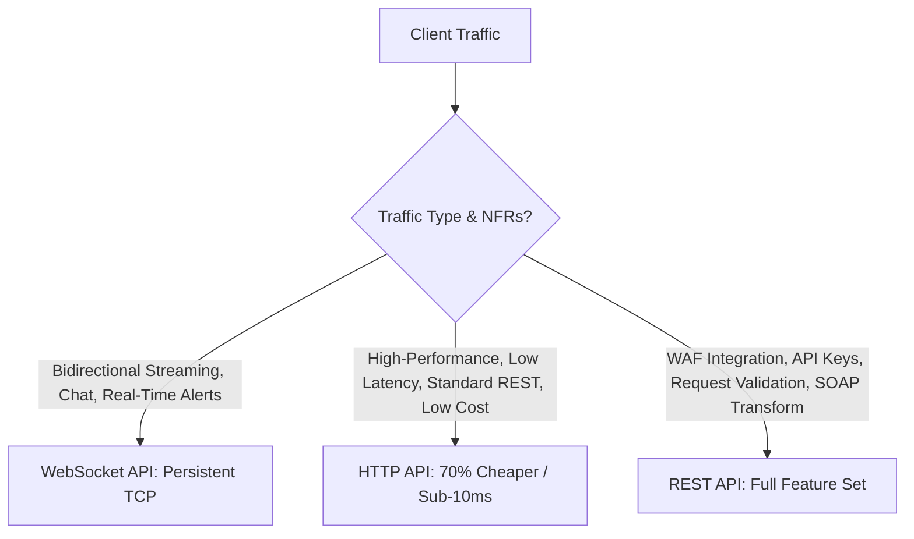

# AWS API Gateway Architecture

## Executive Summary

Amazon API Gateway acts as the managed entry point for external and internal client applications, handling traffic management, authorization, throttling, and API versioning.

---

## 1. REST APIs vs HTTP APIs vs WebSocket APIs

---

## 2. Security & Throttling Architecture

1. **Token-Bucket Throttling**:
   - Enforce rate limits (steady-state requests per second) and burst limits at the API Gateway layer to shield downstream microservices and databases from distributed denial of service (DDoS) traffic spikes.
2. **Lambda Authorizers (Custom Token Validation)**:
   - Validate JWT tokens (issued by Entra ID, Auth0, or Cognito) at the API Gateway edge using cached Lambda Authorizers, ensuring downstream compute only executes requests with verified cryptographic signatures.
