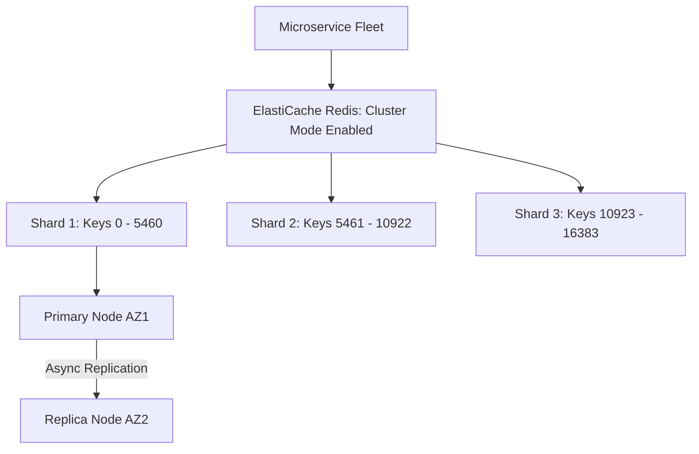

# AWS In-Memory Caching: Amazon ElastiCache

## Executive Summary

Amazon ElastiCache provides managed in-memory data stores using Redis or Memcached. In modern enterprise architecture, ElastiCache for Redis (and Valkey) acts as a high-throughput caching tier, session store, and distributed lock manager.

---

## 1. ElastiCache Redis Cluster Architecture

---

## 2. Architectural Patterns & Best Practices

1. **Cluster Mode Enabled vs Disabled**:
   - **Cluster Mode Disabled**: Limited to a single primary writer node. Write throughput is bound to a single EC2 host CPU core.
   - **Cluster Mode Enabled**: Shards data across up to 500 shards using Redis hash slots. Mandatory for workloads exceeding $100,000 \text{ writes/sec}$ or $250\text{ GB}$ of in-memory data.
2. **Caching Topologies: Cache-Aside vs Write-Through**:
   - **Cache-Aside (Lazy Loading)**: Application queries Redis first; on cache miss, reads from Aurora/PostgreSQL and populates Redis with an explicit TTL. Prevents stale cache buildup.
   - **Thundering Herd Protection**: Implement mutex locking or probabilistic early expiration (XFetch algorithm) to prevent thousands of concurrent requests from hammering the primary database when a popular cache key expires.
