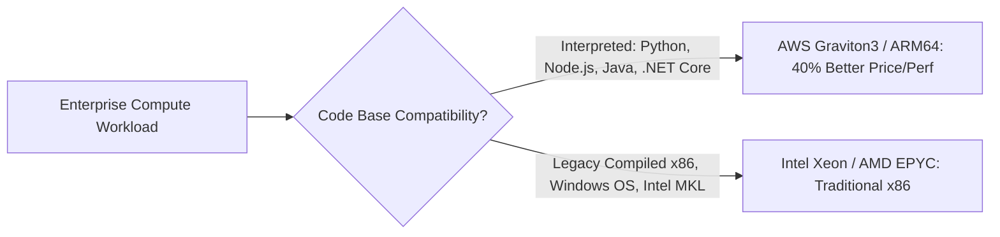

# AWS Compute Architecture: EC2, Nitro & Graviton

## Executive Summary

Amazon Elastic Compute Cloud (EC2) remains the backbone for legacy enterprise applications, stateful monolithic systems, and ultra-high-performance workloads.

---

## 1. The AWS Nitro Architecture

Modern EC2 instances (Generations 5, 6, 7) are powered by the **AWS Nitro System**:
- Dedicated Nitro cards offload virtualization, VPC networking, EBS storage management, and security monitoring from the main host CPU.
- **Architectural Consequence**: 100% of physical host CPU and memory is dedicated to customer virtual machines, eliminating hypervisor jitter and providing bare-metal equivalent performance.

---

## 2. Processor Architecture: x86 vs AWS Graviton (ARM64)

### Graviton Architectural Rule
For JVM (Java 17+), .NET 6+, Python, and Go microservices, Graviton instances (e.g., `c7g`, `m7g`, `r7g`) deliver up to **40% superior price-performance** compared to equivalent x86 instances. Migration requires only recompiling container images for `linux/arm64`.

---

## 3. Purchasing Models & Fleet Sizing

| Purchase Model | Architectural Suitability | Risk Mitigation Strategy |
| :--- | :--- | :--- |
| **On-Demand** | Unpredictable, short-lived workloads, dev testing | High unit cost; migrate to Savings Plans once baseline stabilizes. |
| **Compute Savings Plans**| Predictable baseline compute across 1 or 3 years | Up to 66% discount; covers EC2, Fargate, and Lambda automatically. |
| **EC2 Spot Instances** | Stateless batch workers, CI/CD runners, rendering | Subject to 2-minute termination notice; handle via `SIGTERM` handlers. |
