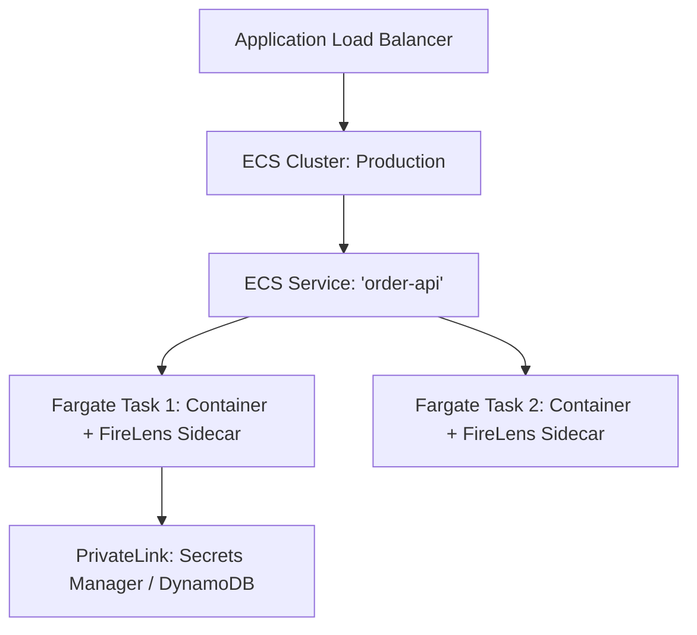

# AWS Containers: ECS and AWS Fargate

## Executive Summary

Amazon Elastic Container Service (ECS) is AWS's opinionated, highly scalable container management service. Paired with **AWS Fargate** (serverless compute for containers), ECS eliminates the operational burden of managing EC2 host virtual machines.

---

## 1. ECS Architectural Topology

---

## 2. ECS vs EKS Decision Matrix

| Architectural Dimension | Amazon ECS + Fargate | Amazon EKS (Kubernetes) |
| :--- | :--- | :--- |
| **Operational Overhead** | Minimal; no control plane to patch or upgrade. | High; control plane upgrades every 14 months, addon lifecycle management. |
| **AWS Integration** | Native, frictionless integration with IAM, CloudWatch, and ALB. | Requires custom controllers (AWS Load Balancer Controller, Karpenter, IRSA). |
| **Startup Latency** | 30–60 seconds for Fargate container cold start. | Sub-second pod startup on pre-warmed node groups. |
| **Portability** | Low; task definitions are proprietary JSON format. | High; standard Kubernetes Helm charts and manifests. |
| **Recommended Scope** | 80% of standard microservices, REST APIs, and background queue workers. | Complex distributed platforms, service meshes, multi-cloud portability mandates. |
